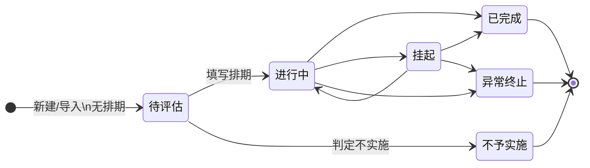

# 举措状态与预警机制

> 对应产品需求：[data/需求@20260601-1.md](../data/需求@20260601-1.md) §四（举措与进展）  
> 设计总览：[DESIGN-20260601-1.md](./DESIGN-20260601-1.md) §3.4  
> 实现代码：`src/domain/actionItemStatusRules.js`、`src/domain/actionItemWarning.js`、`src/domain/actionItem.js`

本文描述 **举措库（ActionItem）** 六种状态之间的关系、排期联动、编辑锁定规则，以及 **超时预警** 的计算与展示。以当前代码为准。

---

## 1. 六种状态

| 中文 | 代码 `status` | 排期 `scheduleAt` | 可编辑（内容 / 排期 / 状态） | 参与预警计算 |
|------|---------------|-------------------|------------------------------|--------------|
| 待评估 | `pending_evaluation` | 必须为空 | 是 | 是 |
| 进行中 | `in_progress` | 通常有值 | 是 | 是 |
| 挂起 | `suspended` | 可有可无 | 是 | **否** |
| 已完成 | `completed` | 可有可无 | **否（锁定）** | **否** |
| 不予实施 | `not_implemented` | 必须为空 | **否（锁定）** | **否** |
| 异常终止 | `abnormal_terminated` | 必须为空 | **否（锁定）** | **否** |

**锁定**（`ACTION_ITEM_LOCKED_STATUSES`）：已完成、不予实施、异常终止。锁定后列表「编辑」禁用；弹窗只读，仅可关闭。

**工单详情「选择已有举措」**：上述三种锁定状态及已完成均不可选（`isActionItemLocked`）。

---

## 2. 状态流转

### 2.1 允许的显式变更

编辑举措时，状态下拉仅展示 **当前状态 + 允许的下一状态**（`ACTION_ITEM_ALLOWED_STATUS_TRANSITIONS`）。

| 当前状态 | 可变更到 |
|----------|----------|
| 待评估 | 进行中、不予实施 |
| 进行中 | 已完成、挂起、异常终止 |
| 挂起 | 进行中、已完成、异常终止 |
| 已完成 | （不可再改） |
| 不予实施 | （不可再改） |
| 异常终止 | （不可再改） |

业务含义简述：

- **不予实施**：评估阶段决定不做，仅能从 **待评估** 进入。
- **异常终止**：执行阶段异常停止，仅能从 **进行中** 或 **挂起** 进入。
- **已完成**：正常闭环结束。

### 2.2 状态图



### 2.3 排期与状态

**举措与进展页**（新建/编辑弹窗）：状态以用户在下拉中的选择为准；改排期**不会**自动改状态，清空排期也**不**等同于待评估。

导入等未显式提供 `status` 时，仍可用 `deriveActionItemStatusFromSchedule` 按排期推断（有排期→进行中，无排期→待评估）。

约束：

- **进行中** 必须填写排期（含从挂起/待评估等变为进行中时）；保存与 API 均校验。
- **待评估 / 不予实施 / 异常终止** 不能填写排期（保存时报错）。
- 变更为 **不予实施** 或 **异常终止** 时：自动 **清空排期**、清除「排期变更」标记、**预警置为 none**。

### 2.4 排期「变更」标签

`scheduleChanged = true` 仅当：**原排期非空** 且与新排期不同。  
「空 → 首次填排期」不算变更。

---

## 3. 预警机制

### 3.1 预警级别

| `warningLevel` | 含义 | 列表展示 |
|----------------|------|----------|
| `none` | 无预警 | 默认文字色 |
| `orange` | 临期提醒 | 琥珀色加粗 |
| `red` | 逾期/超期 | 红色加粗 |

### 3.2 不参与预警的状态

以下状态 **恒为 `none`**，不计算橙/红：

- 已完成、挂起、不予实施、异常终止

进入 **不予实施** 或 **异常终止** 时，若历史上曾有预警，保存后会 **清空为 none**。

### 3.3 待评估：按「首次提出时间」

字段：`firstProposedAt`（`YYYY-MM-DD`）。

以 **自然日** 计算自首次提出至今天的天数 `days`：

| 条件 | 预警 |
|------|------|
| `days >= 30` | red |
| `15 <= days < 30` | orange |
| `days < 15` 或无有效日期 | none |

**界面**：「举措与进展」表格 **首次提出时间** 列（位于 **状态** 列之后）；仅 `status === pending_evaluation` 的行按级别上色。

### 3.4 进行中：按「排期时间」

字段：`scheduleAt`（须能解析 `YYYY-MM-DD` 前缀）。

`daysUntil` = 排期日 − 今天（自然日）：

| 条件 | 预警 |
|------|------|
| `daysUntil < 0`（已过期） | red |
| `0 <= daysUntil <= 15` | orange |
| `daysUntil > 15` | none |
| 无有效排期日期 | none |

**界面**：**排期时间** 列；仅 `status === in_progress` 的行按级别上色。  
若排期旁有橙色 **变更** Tag，与预警独立（表示排期被改过）。

### 3.5 计算与持久化时机

```
读取举措（GET /api/actions…）
  → applyActionItemWarningLevel(item, today)

保存举措（PATCH /api/actions/:id）
  → mergeActionItemPatch（含状态/排期副作用）
  → putActionItem
  → applyActionItemWarningLevel（再次按当天重算）
```

预警 **按服务器当天日期** 重算后写入 `warningLevel` 字段并入库；前端列表直接读库中级别展示，不在浏览器单独算一遍。

---

## 4. 需求工单关联模式

当 `linkedRequirementTicketIds` 非空时，举措进入**需求工单关联模式**（与未关联时的规则并行存在）。

### 4.1 库内字段与展示

| 字段 | 库内（冻结快照） | 列表/导出展示 |
|------|------------------|---------------|
| `content` / `scheduleAt` / `status` | 关联瞬间写入后不再更新 | **不读快照**；排期/状态由同步库聚合 |
| `detail` | 可编辑 | 同库内 |
| `linkedRequirementTicketIds` | 可增删 | 可展开明细（含未同步/未映射提示） |

**列表聚合规则（多工单）**

- **状态** `derivedStatus`：已映射工单中取**最严重优先**（进行中 &gt; 待评估 &gt; 挂起 &gt; 已完成 &gt; 终态）。
- **排期** `derivedScheduleAt`：仅在映射状态等于 `derivedStatus` 的工单中选取；有过去排期时优先过去（取**距今天最远** / 最逾期），仅未来时取**距今天最近**；同时有过去与未来时取过去。

### 4.2 预警

- 关联后：`warningLevel` 按聚合排期 `derivedScheduleAt` 计算，阈值规则同 §3.4（过期红、15 天内橙）。
- 未关联：维持 §3 既有规则。

### 4.3 编辑与保存

- 内容、排期、状态：**只读**；可改举措详情与需求工单号。
- 清空全部需求工单号后恢复可编辑，库内仍为冻结快照值。
- 保存时 `PATCH` 若试图修改上述三项 → 400。

### 4.4 反馈工单同步

已关联需求工单时，保存举措**仅同步举措详情**到关联反馈工单，不同步内容与排期（`actionItemTicketSync.js`）。

### 4.5 Excel 导入 / 导出

| 方向 | 规则 |
|------|------|
| **导入** | 行内填写需求工单时，**忽略**排期时间与状态列；举措内容仍必填；导入后状态为待评估、排期为空 |
| **导出** | 已关联行：排期/状态列输出聚合结果（`derivedScheduleAt` / `derivedStatus`）；无映射状态导出为「待同步」 |

同步主数据与状态映射在 **设置 → 需求工单进展同步**（仅管理员）维护。

---

## 5. 界面与 API 行为摘要

| 场景 | 行为 |
|------|------|
| 举措与进展 · 列表列序 | … 需求工单 → 排期时间 → 状态 → 首次提出时间 → 最近更新 … |
| 举措与进展 · 编辑 | 状态下拉 = 当前 + 允许下一状态；终态只读；保存以表单 `status` 为准 |
| 排期 DatePicker | 待评估 / 不予实施 / 异常终止时禁用；**进行中**必填排期 |
| 排期与状态联动（表单） | 改排期不自动改状态；打开时为 **进行中** 的项，切走再切回进行中时恢复打开弹窗时的排期 |
| 页头统计 / 分产品图表 | 六种状态分别计数 |
| 导入 Excel | 状态列支持六种中文标签；未填状态仍可按排期推断；**已填需求工单则忽略排期/状态列** |
| 导出 Excel | 已关联需求工单时排期/状态列为聚合展示值 |
| 需求工单进展同步 | 设置页管理员 Tab；导入外部进展 + 维护状态映射 |
| Schema | `actionItemStatusSchema` 枚举含六种 `status` |
| 操作审计 | 设置页；`viewAudit` 全角色；`GET /api/audit` 同权限 |

---

## 6. 实现索引

| 职责 | 文件 |
|------|------|
| 状态枚举、标签、合并 patch、排期推导 | `src/domain/actionItem.js` |
| 流转表、锁定、排期副作用 | `src/domain/actionItemStatusRules.js` |
| 预警计算 | `src/domain/actionItemWarning.js` |
| 状态标签/图表颜色 | `src/domain/actionItemStatusStyle.js` |
| 列表与编辑 UI | `src/pages/Actions.jsx` |
| 保存时重算预警 | `server/actionItemRepository.js` |
| 需求工单聚合与导入规则 | `src/domain/requirementTicketProgress.js`、`src/lib/actionItemImport.js` |
| 需求工单进展同步 API | `server/routes/requirementTicketProgress.js` |
| API 状态枚举 | `server/schemas/common.js` |

单元测试：`src/domain/actionItemStatusRules.test.js`、`src/domain/actionItemWarning.test.js`、`src/domain/actionItem.test.js`。

---

## 7. 变更记录

| 日期 | 说明 |
|------|------|
| 2026-05-31 | 表单状态与排期解耦；进行中必填排期；列表列序调整；编辑弹窗切回进行中恢复打开时排期 |
| 2026-06 | 新增 **不予实施**、**异常终止**；终态锁定；预警对二者恒为 none 并在进入时清空 |
| 2026-06 | 需求工单关联模式：进展同步、列表聚合、编辑锁定、导入/导出规则 |
