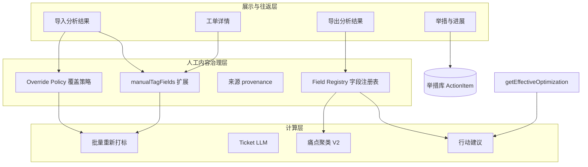
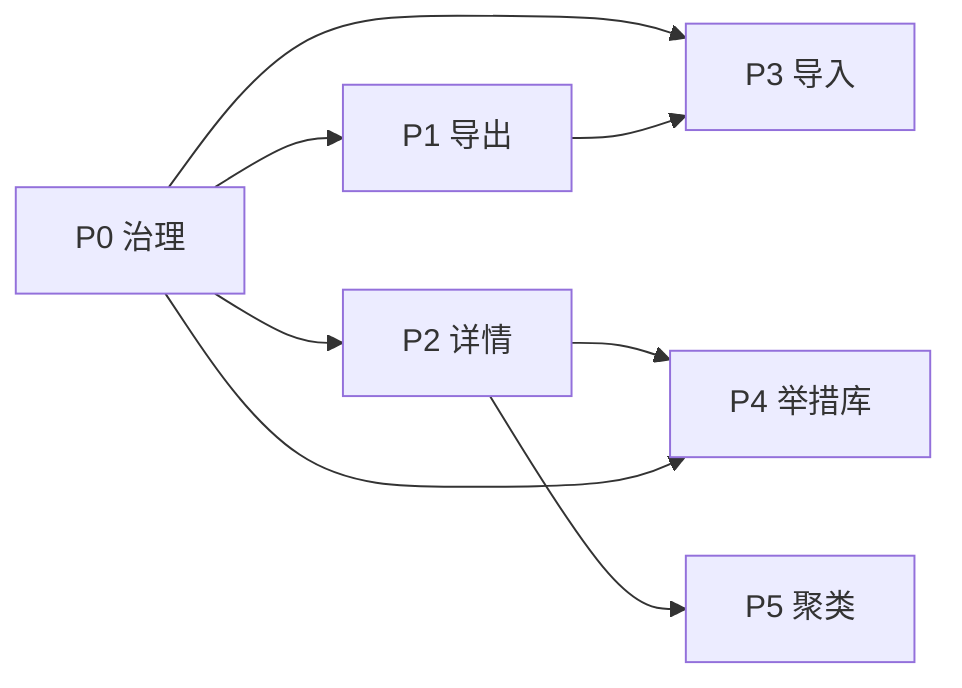

# 设计文档 · 需求 @20260601-1

> 对应产品需求：[data/需求@20260601-1.md](../data/需求@20260601-1.md)  
> 状态：详细设计 + 任务索引  
> 最后更新：2026-06-01  
> **可执行任务清单**：[TASKS-20260601-1.md](./TASKS-20260601-1.md)

---

## 0. 背景与目标

### 0.1 问题域

| 问题域 | 现状 | 目标 |
|--------|------|------|
| 字段语义混乱 | 问题类型≈终判、legacy 复核字段、来源 Tag 与导出列不一致 | **Field Registry** 统一「展示名 / 存储 / 是否人工 / 是否导出 / 是否聚类语料」 |
| 分析结果不可往返 | 仅 Excel 导入工单；导出列与详情编辑模型脱节 | **导出 ↔ 导入分析结果** 闭环（按工单号覆盖） |
| 举措分散 | `manualReviewOptimization` 单字段 | **确立举措 + 举措库 + 举措与进展** |
| 批量打标与人工冲突 | `preserveManualTags` 与 scope 行为不一致 | **Override Policy** 统一默认/强制覆盖/导入覆盖 |
| 多人协作 | 曾可并发批量打标/导入 | **全局锁**（已实现，纳入设计基线） |

### 0.2 已落地基线

- 服务端 **批量导入/打标全局锁**（3 分钟无心跳可抢占，`BACKGROUND_TASK_STALE_MS`）
- 列映射：**投诉产品**、**问题原因**、**优化举措/建议**；咨询/投诉预设默认 **具体投诉产品**
- **咨询工单终判导出**：`getSourceColumnValue` 不再用 `problemType` 回填终判列
- 聚类语料规则：`需求§五`、`docs/PAIN-POINT-CLUSTERING.md`

### 0.3 已确认产品决策

| 主题 | 决策 |
|------|------|
| 强制覆盖 vs 举措库 | 仅解工单侧关联，**不删除**举措库记录 |
| 强制覆盖 → 根因排查 | 回退 `sourceColumns['问题原因']` 或 `rootCause` |
| 导入回写 · 来源 UI | 客户请求/痛点/优化来源 Tag 统一显示 **「人工」** |
| Legacy 三字段 | `manualReviewRootCause/Solution/Action` 停止写入；强制覆盖静默清空 |
| 聚类优化语料 | **确立举措优先**；产品组/设计师 **不纳入** |
| 咨询工单终判 | 终判 ≠ 问题类型；咨询单终判应为空 |
| 工单详情布局 | **保留现有「工单分类」**；与 **投诉原因（终判）** 一并放在 meta 下方最上（见 §3.1） |
| **R1 · 排期可空** | 导入/详情 **排期允许为空**；空排期对应举措状态 **待评估**（与 §四 一致） |
| **R2 · 导入来源 UI** | 界面 Tag **「人工」**；库内 `manual` / `import`（已修订需求 §三.3） |
| **R3 · 导入范围** | **仅更新库内已存在**的工单；导入表工单号不存在 → **跳过该行并汇总提示**，不新增记录 |
| **R4 · 确立举措存储** | 工单侧 **文本副本 + `actionId`** 双写；以 `actionId` 关联举措库，文本为展示/导出/聚类副本 |

---

## 1. 总体架构

### 1.1 三层模型



### 1.2 Override Policy

| 策略 | 触发 | 行为摘要 |
|------|------|----------|
| `RESPECT_MANUAL` | 默认批量打标 | 保留 `manualTagFields` 标记维度；保留确立举措等人工字段 |
| `FORCE_ALL_HUMAN` | 勾选「强制覆盖全部人工内容」 | 见 §1.3 |
| `IMPORT_REPLACE` | 导入分析结果 | 按工单号覆盖；**空单元格也覆盖**；全盘标人工；来源 UI 显示 **人工** |

三种策略共用 **Field Registry**，禁止在 Export/Import/BulkRetag 各写一套清空逻辑。

### 1.3 强制覆盖（FORCE_ALL_HUMAN）

**清空 / 解除（工单侧）**

- `manualTagFields` 全部清空
- **确立举措** 文本 + 本工单与举措库的关联（`actionId` 等）；**不删除** 举措库记录
- **legacy 三字段** 静默置空：`manualReviewRootCause/Solution/Action`
- 产品组/设计师建议（新字段上线后）清空

**覆盖（重算）**

- 请求场景、问题类型、用户旅程、用户情绪、加急
- 若 scope 含 Ticket LLM：客户请求、痛点、产品/服务自动优化

**特殊：根因排查**

- 强制覆盖后 **回退** 为 `sourceColumns['问题原因']` 或 `rootCause`（便于二次人工），**不是** 长期留空

**不动**

- 受理/处理原文、备注、跟进状态 `status`、投诉原因（终判）、未纳入 scope 的工单字段

**scope 一致性（待实现）**

- 「补打 / 补打旅程」与「全量重打」在清空/回退规则上 **必须相同**（当前仅全量走 `applyForceRetagOverrides`，需统一）

### 1.4 咨询工单终判规则

| 项 | 规则 |
|----|------|
| 写入 | 仅 `dataSourceType === complaint_ticket` 写 `complaintCauseL*Final` |
| 展示/统计/聚合 | `isComplaintTicket` 过滤 |
| 导出汇总列「投诉原因（终判）」 | 咨询为空 |
| 导出快照列「投诉原因 *（终判）」 | 只读终判字段/快照，**禁止** fallback `problemType` |
| 列映射 | 咨询预设 **不映射** 终判三列 |

### 1.5 聚类语料（§五）

| 语料 | 纳入 |
|------|------|
| 确立举措 | **是，优先**（现 `manualReviewOptimization`） |
| 产品/服务自动优化 | 无确立举措时 |
| 产品组/设计师建议 | **否** |
| 痛点主文本 | 始终 `painPoint` |

实现锚点：`getEffectiveOptimization`，**禁止**把产品组/设计师并入。

### 1.6 导入回写 · 来源 Tag

- 库内：`customerRequestSource` / `painPointSource` / optimization 来源记 **`manual` 或 `import`**（不用 `llm`，避免与 UI 矛盾）
- UI：三项来源 Tag 统一 **「人工」**
- 导出：**不输出** 来源三列

---

## 2. Field Registry

### 2.1 注册表条目结构（概念）

```
fieldKey          // 内部键，如 establishedAction, rootCauseReview
displayName       // 界面/导出列名
recordPaths[]     // 读写路径
exportable        // 是否参与导出 v2
exportOrder       // 导出列序
importable        // 是否参与导入分析
manualDimension   // 是否写入 manualTagFields
clusterRole       // none | painPrimary | optimizationCorpus
provenanceField   // 来源字段（仅库内）
applicableSources // complaint_ticket | consultation_ticket | *
legacy            // 是否待废弃
```

### 2.2 导出 v2 列序

> **迁移说明**：[EXPORT-V2-MIGRATION.md](./EXPORT-V2-MIGRATION.md)

| 序 | 列名 | fieldKey | 备注 |
|----|------|----------|------|
| 1 | 工单号 | ticketId | |
| 2 | 客户请求内容 | customerRequest | |
| 3 | 需求痛点 | painPoint | |
| 4–8 | 四维+加急 | requestScene…urgency | 加急导出为「是否加急」文案 |
| 9–10 | 产品技术优化 / 服务流程改进 | optimizationProduct/Service | |
| 11 | 确立举措 | establishedAction | 文本副本；关联 `actionId`（R4） |
| 12 | 排期 | actionSchedule | 新字段 |
| 13–15 | 受理内容 / 处理意见 / 根因排查 | rawText/handlingText/rootCauseReview | |
| — | 来源三列 | *provenance* | **exportable=false** |
| — | 失效列 | 问题摘要、根因、优化建议（汇总）、投诉原因（终判）单列表述等 | **退役** |

### 2.3 退役与迁移

| 旧 | 处置 |
|----|------|
| `manualReviewRootCause/Solution/Action` | 停止写入；强制覆盖清空；导出移除 |
| 导出「投诉原因（终判）」单列表述 | 与需求 §1.1 失效字段检查结论绑定 |
| `manualReviewOptimization` | 读写迁移到 **确立举措文本** + **`actionId`**（R4） |

### 2.4 详情页字段分区（Registry 视角）

| 区域 | 字段 | 备注 |
|------|------|------|
| B1 工单分类 | requestScene, problemType, journey*, sentiment, urgency | 打标维度；`manualTagFields` |
| B2 终判 | complaintCauseL*Final | 只读；不参与打标/聚类 |
| C 分析内容 | customerRequest, painPoint, optimization* | 分析 + 确立举措语料 |
| D 处理与备注 | handlingText/rawText, rootCauseReview, note | 原文 + 人工根因 |

---

## 3. 分模块详细设计

### 3.1 工单详情 · 布局（修订）

纵向分区自上而下：

```
┌─────────────────────────────────────────┐
│ A. 基础信息（只读一行）                    │
│    工单号 · 产品（含具体投诉产品）· 数据来源  │
├─────────────────────────────────────────┤
│ B. 标签区（最上方，保留现有 + 终判）         │
│    B1. 工单分类（原有，可编辑/只读逻辑不变）   │
│    B2. 投诉原因（终判）（仅投诉工单）         │
├─────────────────────────────────────────┤
│ C. 分析内容区                              │
│    客户请求 · 需求痛点 · 优化建议…           │
├─────────────────────────────────────────┤
│ D. 处理与备注                              │
│    处理意见（原文）· 根因排查 · 备注         │
└─────────────────────────────────────────┘
```

**原则**：B 区是「维度标签 + 终判」，C/D 是「挖掘结果 + 原文/人工复核」。新字段（确立举措、产品组/设计师建议、排期、根因排查）**不进入 B 区**。

#### A · 基础信息

与现网 `ticketMetaLine` 一致：`工单号 · 产品（productSpec）· 数据来源`。

#### B1 · 工单分类（完整保留现有）

保留 `FeedbackDrawer` 中「工单分类」Card 的全部内容与行为：

| 字段 | 改版后 |
|------|--------|
| 请求场景 | **不变** |
| 问题类型 | 投诉单仍显示「问题类型（打标）」 |
| 用户旅程 | 一级 + 二级，**不变** |
| 用户情绪 | **不变** |
| 加急 / 催促 | **不变** |
| 底部提示 | 「支持人工复核修改」，**不变** |
| 权限 | `canEdit` 可编辑，否则只读，**不变** |

**不**拆成 Tag 条、**不**下移到优化区或处理区。

#### B2 · 投诉原因（终判）

紧接 B1 下方；仅 `isComplaintTicket(record)` 展示；一级/二级/三级只读；咨询工单不展示此 Card。

#### C · 分析内容区

1. **客户请求内容**（含来源 Tag）
2. **需求痛点挖掘**（含来源 Tag）
3. **优化建议**（含来源 Tag）
   - 产品/技术优化、服务/流程改进（只读，自动）
   - 产品组优化建议、设计师优化建议（新增，≤1000 字，不参与聚类）
   - **确立举措** + **排期**（替代「人工复核后的优化建议」）

#### D · 处理与备注

1. **处理意见（工单原文）** — 优先「处理意见」列，否则「受理内容」
2. **根因排查**（新增）— 默认 `sourceColumns['问题原因']` / `rootCause`，可编辑 ≤1000 字
3. **备注**

**相对现网**：处理意见从 B 与 C 之间 **下移至 D**，与根因排查成组；**B 区顺序与现网一致**（meta → 工单分类 → 终判）。

#### 线框

```
工单详情
──────────────────────────────────
工单号 · 产品 · 数据来源                    ← A

┌ 工单分类 ────────────────────────┐      ← B1（保留）
│ 请求场景 | 问题类型（打标）          │
│ 用户旅程 | 用户情绪 | 加急           │
└──────────────────────────────────┘

┌ 投诉原因（终判） ─── 仅投诉工单 ────┐      ← B2
│ 一级 / 二级 / 三级（只读）           │
└──────────────────────────────────┘

┌ 客户请求内容 [来源Tag] ────────────┐      ← C
┌ 需求痛点挖掘 [来源Tag] ────────────┐
┌ 优化建议 [来源Tag] ────────────────┐
│ 自动优化 | 产品组 | 设计师          │
│ 确立举措 + 排期                     │
└──────────────────────────────────┘

┌ 处理意见（工单原文） ──────────────┐      ← D
┌ 根因排查 ─────────────────────────┐
备注
──────────────────────────────────
[重新打标] [保存]
```

#### 确立举措与举措库

**存储（R4）**：工单记录同时保存 **`establishedAction` 文本副本** 与 **`actionId`**（关联举措库）。展示、导出、聚类语料读文本副本；选库/改库以 `actionId` 为准；库内容变更时可同步刷新副本（P4）。

- **手动输入**：≤1000 字；可填排期（**可空**，空=待评估）；保存时 upsert 举措库并写 `actionId` + 文本副本
- **选择已有**：SearchSelect + 举措状态；排期只读来自库
- 保存 → 更新 `manualTagFields`（含 optimization 维度）

#### 来源 Tag

- Ticket LLM：**规则 / 大模型**
- 导入回写 / 详情人工：**人工**
- 优化区：有确立举措 → **人工**；否则规则/LLM

---

### 3.2 导出分析结果（需求 §一）

- 新行映射 **唯一** 读 Field Registry
- 按 `dataSourceType` 过滤不适用列
- 来源三列不导出
- **回归**：咨询工单终判列全空；问题类型列 ≠ 终判列

---

### 3.3 导入分析结果（需求 §三）

#### 流程

```
上传 Excel → 列名校验（固定 17 列，多余忽略）
→ 工单号匹配现有库内记录（R3：不存在则跳过并记入结果摘要）
→ 匹配成功行按 IMPORT_REPLACE 写入
→ manualTagFields 满标
→ provenance 记 manual/import；UI 来源=人工（R2）
→ bumpDataRevision；可选触发洞察重建
```

#### 校验

- **必填**（除排期外）：工单号、客户请求、需求痛点、请求场景、问题类型、用户旅程一/二级、用户情绪、是否加急、产品/服务优化、确立举措、受理内容、处理意见、根因排查
- **排期允许为空**（R1）；空排期写入后举措侧状态为 **待评估**
- 工单号 **须已存在于库内**（R3）；不存在不阻断整批，汇总「未匹配 N 条」
- 枚举值（情绪、加急等）合法

#### 全局锁

- 占用 **`import` 类型全局锁**，与工单 Excel 导入、批量打标互斥

---

### 3.4 举措与进展（需求 §四）

#### ActionItem（概念）

```
id, productKey/productName
content
status                     // 待评估|进行中|已完成|挂起|不予实施|异常终止
firstProposedAt
scheduleAt
painPointSnapshot, problemTypeSnapshot, journeyL1Snapshot
linkedTicketIds[]
linkedDataSources[]
scheduleChanged
warningLevel               // none|orange|red
createdAt, updatedAt
```

#### 状态与预警

- **举措与进展页**新建/编辑：状态以用户下拉选择为准，改排期不自动改状态。
- **导入**等未显式 `status` 时：排期空 → **待评估**；有排期 → **进行中**（`deriveActionItemStatusFromSchedule`）。
- 列表列顺序（靠后）：… 排期时间 → 状态 → 首次提出时间 → …
- 预警规则按需求 §4.5；六种状态、流转、锁定与橙/红计算见 **[ACTION-ITEM-STATUS-AND-WARNING.md](./ACTION-ITEM-STATUS-AND-WARNING.md)**

#### 路由

- 一级模块 `/actions`（名称待定）

---

### 3.5 批量重新打标 · 强制覆盖

#### 弹窗文案 v2

```
勾选「强制覆盖全部人工内容」后：

· 清空：人工维护标记；本工单的确立举措及排期（不删除举措库中其他工单共用的举措）。
· 根因排查：回退为导入「问题原因」，便于再次人工修改。
· 覆盖：请求场景、问题类型、用户旅程、用户情绪、加急（不保留原人工值）。
· 若本次含工单 LLM：客户请求、需求痛点、产品/服务优化建议（自动）一并重算。
· 不修改：受理/处理原文、备注、跟进状态、投诉原因（终判）等。

补打/补打旅程与全量重打在以上规则上一致。
```

#### 实现要点

- 所有 scope 入口统一 `applyForceRetagOverrides`（或 Registry 驱动）
- 确立举措：清文本 + 清 `actionId`；**不** DELETE ActionItem

---

## 4. 存储与 API（概念）

| 实体 | 存储 | 说明 |
|------|------|------|
| InsightRecord 扩展字段 | SQLite `records.payload` | 根因排查、产品组/设计师建议、排期、actionId |
| ActionItem | 新表 `action_items` | 举措库 |
| Field Registry | 代码常量 + 单测 | 暂不入库 |
| background_task_lock | meta 键 | 已有 |

**API 草案**

- `GET/POST/PATCH/DELETE /api/actions` — 举措 CRUD + 列表筛选
- `POST /api/storage/import-analysis` — 导入分析结果（持锁）

---

## 5. 任务分解（索引）

完整子任务、估时、涉及文件与验收标准见 **[TASKS-20260601-1.md](./TASKS-20260601-1.md)**。

### 里程碑

| 里程碑 | Phase | 估时 | 出口 |
|--------|-------|------|------|
| M0 治理就绪 | P0 | ~8d | Override 全 scope；Registry 就绪 |
| M1 可导出 | P1 | ~4d | 导出 v2 17 列 |
| M2 可编辑 | P2 | ~8d | 详情 A→B→C→D |
| M3 可往返 | P3 | ~7d | 导入分析 + 往返测 |
| M4 举措闭环 | P4 | ~14d | 举措库 + 列表 + 预警 |
| M5 聚类对齐 | P5 | ~2d | 语料规则单测 |

**合计约 43 人日**；建议顺序 P0 → P1 → P2 → P3 → P4，P5 随 P2。

### Phase 摘要

| ID | 任务 | 交付物 | 依赖 |
|----|------|--------|------|
| P0-1 | Field Registry v1 | 常量 + 单测；导出列序 | — |
| P0-2 | Override Policy 落地 | FORCE/IMPORT/RESPECT 边界 | P0-1 |
| P0-3 | 批量打标强制覆盖行为统一 | 全 scope 同一套清空/回退；弹窗文案 v2 | P0-2 |
| P0-4 | 根因排查字段（数据层+回退） | 新字段；强制覆盖回退问题原因 | P0-2 |
| P0-5 | legacy 三字段停止写入 | 导出/详情/导入均不再读写 | P0-1 |
| P0-6 | 导入回写来源=人工 | Tag 映射；修订需求 §3.3 | P0-1 |
| P0-7 | 终判 hasIncompleteSourceColumns | 咨询不要求终判快照列完整 | P0-1 |
| P0-8 | 回归测试清单 | TEST-PLAN 增补 | P0-3,7 |

### Phase P1 · 导出 v2（1 周）

| ID | 任务 | 交付物 | 依赖 |
|----|------|--------|------|
| P1-1 | recordToExportRowV2 | 17 列 + 顺序 | P0-1 |
| P1-2 | 退役列移除与迁移说明 | 旧导出列对照表 | P1-1 |
| P1-3 | 确立举措列名映射 | 过渡用 manualReviewOptimization | P1-1 |
| P1-4 | 排期/根因排查列 | 新字段占位策略 | P0-4 |
| P1-5 | 导出 UAT | 投诉/咨询各抽样 | P1-1 |

### Phase P2 · 工单详情改版（2 周）

| ID | 任务 | 交付物 | 依赖 |
|----|------|--------|------|
| P2-0 | **布局约束** | A→B1→B2→C→D；B 区不重构 | — |
| P2-1 | 确立举措模块（先仅输入） | C 区优化 Card 内部 | P0-1 |
| P2-2 | 根因排查 | D 区；处理意见下移 | P0-4 |
| P2-3 | 产品组/设计师建议 | C 区；不参与聚类 | P0-1 |
| P2-4 | 排期 | 与确立举措联动 | P2-1 |
| P2-5 | manualTagFields 扩展 | 含 customerRequest/painPoint 等 | P0-1 |
| P2-6 | 来源 Tag 规则 | 导入/人工/LLM | P0-6 |
| P2-7 | UAT | B 区仍在最上；咨询无终判 | P2-0~6 |

### Phase P3 · 导入分析结果（2 周）

| ID | 任务 | 交付物 | 依赖 |
|----|------|--------|------|
| P3-1 | 新入口「导入分析结果」 | 与工单 Excel 导入区分 | P0-1 |
| P3-2 | 列校验 + 17 列映射 | 空值覆盖 | P3-1 |
| P3-3 | IMPORT_REPLACE | 按 ticketId；**仅更新已存在**（R3） | P0-2 |
| P3-4 | manualTagFields + 来源人工 | | P3-3 |
| P3-5 | 全局锁接入 | | 已有 |
| P3-6 | 导出↔导入往返测试 | | P1-1, P3-3 |

### Phase P4 · 举措库与举措与进展（3–4 周）

| ID | 任务 | 交付物 | 依赖 |
|----|------|--------|------|
| P4-1 | ActionItem 表 + Repository | CRUD API | — |
| P4-2 | 确立举措选库 UI | SearchSelect | P4-1, P2-1 |
| P4-3 | 手动输入自动入库 | | P4-1 |
| P4-4 | 强制覆盖解关联不删库 | | P0-3, P4-1 |
| P4-5 | 举措与进展列表页 | 筛选/统计/分页 | P4-1 |
| P4-6 | 行操作 | 改状态/内容/排期 | P4-5 |
| P4-7 | 超时预警 | 橙/红规则 | P4-5 |
| P4-8 | 首单字段 sync | painPoint/问题类型/旅程 | P4-1 |

### Phase P5 · 聚类与行动建议对齐（1 周）

| ID | 任务 | 交付物 | 依赖 |
|----|------|--------|------|
| P5-1 | getEffectiveOptimization 读确立举措 | | P2-1 |
| P5-2 | 断言产品组/设计师不进入语料 | 单测 | P2-3 |
| P5-3 | 行动建议 help 与 §五 一致 | | P5-1 |

### 依赖关系



**建议迭代顺序**：P0 → P1 → P2 → P3 → P4；P5 随 P2 收尾。

---

## 6. 待确认项

| # | 项 | 状态 / 决策 |
|---|-----|-------------|
| R1 | 排期导入/详情是否可空 | **已确认**：可空；空=待评估（见 §0.3） |
| R2 | 导入来源 UI vs 库内值 | **已确认**：UI「人工」；库内 `manual`/`import`（见 §0.3） |
| R3 | 导入工单号不存在 | **已确认**：仅更新已存在；未匹配行跳过并汇总（见 §0.3） |
| R4 | 确立举措与举措库 | **已确认**：文本副本 + `actionId`（见 §0.3、§3.1） |
| R5 | 历史数据 migration | **待办**：P1 后可选脚本 legacy→新字段 |

---

## 7. 测试策略（摘要）

| 层 | 范围 |
|----|------|
| 单测 | Registry、Override、终判、getEffectiveOptimization、ActionItem 状态机 |
| 集成 | 导出→导入往返；强制覆盖×举措库；全局锁×打标×导入 |
| UAT | 需求四板块；咨询/投诉各 20 条；详情 B 区在最上 |

**关联设计**（独立迭代）：[用后即评 · 满意度回访](./DESIGN-用后即评-满意度回访.md)（工单 enrichment + 工作台回访模块；UAT 见 [FOLLOW-UP-SATISFACTION-UAT.md](./FOLLOW-UP-SATISFACTION-UAT.md)）
