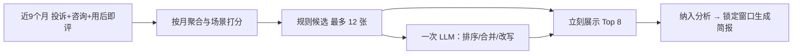

# 专题分析模块说明

> 状态：**Beta 版，已实现**。  
> 读者：产品 / 分析 / 研发。本文是专题分析的功能、规则与数据口径说明。  
> 用户操作入口见 [USER-GUIDE.md](./USER-GUIDE.md)「深入一个专题」。  
> 报告落盘见 [DATA-PERSISTENCE.md](./DATA-PERSISTENCE.md) `meta.topic_analysis_reports_v1`。

**目录**

1. [模块定位](#1-模块定位)
2. [页面与路由](#2-页面与路由)
3. [数据口径](#3-数据口径)
4. [系统推荐规则](#4-系统推荐规则)
5. [LLM：排序 / 合并 / 改写](#5-llm排序--合并--改写不选题)
6. [纳入分析与新建专题](#6-纳入分析与新建专题)
7. [简报生成](#7-简报生成纳入之后)
8. [存储](#8-存储)
9. [Beta 边界与已知限制](#9-beta-边界与已知限制)
10. [代码地图](#10-代码地图)
11. [操作步骤](#11-操作步骤)
12. [字段与常量](#12-字段与常量)
13. [权限、刷新与协作](#13-权限刷新与协作)
14. [与工作台对照](#14-与工作台对照)
15. [常见情况](#15-常见情况)

---

## 1. 模块定位

专题分析用来**就某一个对象把系统已有证据收齐**，给出带信息源的初步判断。对象只有三类：

| 类型 | 含义 | 典型问题 |
|------|------|----------|
| 客户专题 `customer` | 同一客户在窗口内反复出现 | 这家高价值客户最近几个月一直在投诉什么 |
| 产品问题专题 `product_issue` | 同一产品上的同一问题键 | 弹性公网 IP 的带宽限速是否值得单独立项 |
| 共性问题专题 `common_issue` | 同一问题键跨多个产品 | 控制台卡顿是不是跨产品共性 |

它**不是**洞察工作台的替代：工作台按全局洞察周期看全量结论；专题分析沿一条线索下钻，并允许把本地材料并进同一份报告。

### 1.1 与工作台的硬边界

| 事项 | 约定 |
|------|------|
| 工作台顶部「洞察周期」 | **不改、不写入**。推荐取数在内存构造自定义周期对象 |
| 推荐窗口 | 固定近 9 个自然月（含本月），页面无周期选择器 |
| 新建专题 | 弹层内用本地 `InsightPeriodPicker` 选周期，只作用于该份报告 |
| 洞察快照 | 不依赖、不刷新。专题直接扫反馈记录，不读工作台 `overviewSnapshot` |
| 推荐卡 | 只给出简介、场景标签、理由、依据；**不做完整长文** |

### 1.2 用户任务

1. 看系统认为近 9 个月值得深入的专题。
2. 「纳入分析」生成报告并锁定当时窗口。
3. 或自己指定类型与一段描述，先理解并确认范围，再选周期新建专题。
4. 在详情阅读带信息源的简报；随时上传本地补充材料后重算。

---

## 2. 页面与路由

| 路由 | 页面 | 作用 |
|------|------|------|
| `/topics` | `TopicAnalysis.jsx` | 两个 Tab：系统推荐专题 / 专题报告 |
| `/topics?tab=reports` | 同上 | 已纳入或新建的报告列表 |
| `/topics/:reportId` | `TopicReportDetail.jsx` | 报告详情、补充材料、按系统数据重算 |

左导航「专题分析」对应 `/topics`。页面标题带橙色 **Beta 版** 标签。

### 2.1 系统推荐专题 Tab

- 卡片字段：类型 Tag、标题、场景 Tag、简介、推荐理由、周期标签、条数、分来源计数、1～3 条原话。
- 副文案：「近 9 个月投诉/咨询/用后即评综合推荐」。
- 规则卡立刻展示；若已配置 LLM，异步精炼后提示「理由已经 AI 精炼」，不挡住纳入分析。
- 可用类型 Segmented 过滤（全部 / 客户 / 产品问题 / 共性）。
- 未纳入：「纳入分析」；同一推荐（含合并后的 `mergeIds`）已有报告：「查看报告」。

### 2.2 专题报告 Tab

卡片展示标题、类型、来源（系统推荐 / 用户新建）、**我创建的 / 某人创建 / 未知创建人**、分析周期、补充材料份数（若有人上传过则附「谁上传了补充材料」）、更新时间。右上角「新建专题」。我创建的排在前面。

### 2.3 详情页简报结构

自上而下固定为：

1. 范围与可信度  
2. 为何值得深入  
3. 发生了什么（系统统计）  
4. 用户怎么说  
5. 初步判断  
6. 已有举措与缺口  
7. 用户补充材料  
8. 待补充  
9. 信息源  

主张标注：`系统统计` / `AI 归纳` / `用户补充`。工单号可跳转反馈库。

操作：提供补充材料（上传即重算）、按系统数据重算（保留已上传材料）。

---

## 3. 数据口径

### 3.1 记录来源

推荐与报告取数均为：

`listAllFeedbacks(adapter)` → `filterRecordsForScope(all, period)`

| 纳入 | 不单独作为推荐主样本 |
|------|----------------------|
| 投诉工单 `complaint_ticket` | 用户调研 / 其他（会出现在 `listAllFeedbacks` 中，但问题键/场景规则基本打不上） |
| 咨询工单 `consultation_ticket` | 洞察快照、行动建议正文本身（举措只作「未闭环」信号） |
| 用后即评 `post_use_rating` | — |

客服拜访记录（`visit_records`）**不进推荐打分**，只在生成简报时按专题关键词匹配，最多 12 条。

### 3.2 时间：记录落在哪个月

与工作台周期过滤同一套 `recordDataDate` / `recordMatchesPeriod`：

1. `importMonth`（`YYYY-MM`）→ 当作该月 1 日  
2. 否则 `createdAt` 的日期  
3. 否则 `importedAt` 的日期  
4. 都没有 → **不落入任何周期**

推荐场景打分用的月份键是上述日期的 `YYYY-MM`。拜访记录用 `importMonth` 或 `visitMonth`，缺月份则不过滤（仍可能进入简报）。

### 3.3 推荐窗口（近 9 个月）

常量：`TOPIC_ROLLING_MONTHS = 9`，`TOPIC_RECENT_MONTHS = 4`，`TOPIC_BASELINE_MONTHS = 5`。

以「今天」所在自然月为 `toMonth`（含本月），往前共 9 个月。例：`toMonth = 2026-08`：

| 桶 | 月份 | 用途 |
|----|------|------|
| 近期 | 2026-05、06、07、08 | 是否仍在发生、是否加重、是否新出现 |
| 基线 | 2025-12、2026-01、02、03、04 | 对比近期月均 |
| 全窗口 | 2025-12 … 2026-08 | 入选、条数、覆盖月数 |

构造方式：`buildPeriodSpec({ granularity: 'custom', fromMonth, toMonth })` → `insightPeriodFromSpec`。**只存在内存，不写入洞察周期列表。**

纳入分析时把 `fromMonth` / `toMonth` / `label` 写入该份报告；之后打开详情按锁定窗口取数，不再跟「今天」滚动。新建专题以用户所选周期为准，不拆近期/基线。

### 3.4 问题键（产品问题 / 共性分组）

优先取第一个非空、且不是「未识别 / 未分类 / 未识别环节」的值：

1. `problemType`  
2. `feedbackReasonPrimary`  
3. `feedbackReasonTexts[0]`  
4. `journeyL1`  

用后即评往往没有工单问题类型，因此允许落到评价原因或一级旅程，以便和工单对齐。没有问题键的记录**不进入**产品问题卡、共性卡。

### 3.5 产品名

`product` → `productName`，去空白。没有产品名的记录不进入产品问题卡；共性卡仍可按问题键聚合，但入选要求至少 2 个不同产品名。

### 3.6 负向 / 强负向 / 高价值

| 口径 | 规则 |
|------|------|
| 负向记录 | 工单情绪为轻度不满 / 不满 / 强烈不满（`mild_negative` / `negative` / `strong_negative`），**或** 用后即评 `ratingScore < 7` |
| 强负向/加急 | `sentiment === 'strong_negative'` **或** `urgencyLevel === 'high'` |
| 高价值客户 | 客户等级文本匹配 `金牌` 或 `银牌`（字段：`customerTier` 或源列「移动云客户服务等级」） |
| 回访仍不满 | `followUpSatisfaction.problemResolved === 'unresolved'`，或回访分 `< 7` |

### 3.7 客户身份

| 字段 | 来源 |
|------|------|
| 编码 | `customerCode` 或源列「集团客户编码」 |
| 名称 | `customerName` 或源列「集团名称」 |
| 等级 | `customerTier` 或源列「移动云客户服务等级」 |

匹配优先级（客户信息已复原后按精确匹配，不再做名称包含）：

1. 双方都有编码且相同 → `code`（精确）  
2. 否则名称去空白、去括号后**完全相等** → `name`（精确）  
3. 都对不上 → 不算同一客户  

分组键：有编码用 `code:规范化编码`，否则 `name:规范化名称`；两者都空则该条**不进客户专题**。`甲公司` 不会命中 `甲公司科技`。

历史脱敏工单可在反馈库用 **复原客户信息（临时）** 按工单号回填。8 月及以后源数据会自带客户字段；入口由 `CUSTOMER_RESTORE_IMPORT_ENABLED` 控制，改 `false` 即下架。专题分析本身不做客户主数据还原。

---

## 4. 系统推荐规则

原则：**事实由规则出卡；LLM 只排序、合并相似项、改写简介/理由，不能新造缺信号的专题。**



实现：`src/lib/topicAnalysis/recommendTopics.js`。推荐页还会拉取状态为 `pending_evaluation` / `in_progress` / `suspended` 的举措（最多 80 条）供「未闭环」打标。

### 4.1 三类对象怎么聚

| 类型 | 分组键 | 卡片 id | 标题 |
|------|--------|---------|------|
| 客户 | 客户身份键 | `customer:{identityKey}` | `客户 · {名称或编码}` |
| 产品问题 | `产品::问题键` | `product:{产品}:{问题键}` | `{产品} · {问题键}` |
| 共性 | 问题键（跨产品） | `common:{问题键}` | `共性问题 · {问题键}` |

同一窗口内三类并行出卡，再按分数去重截断。产品问题卡与共性卡可能同时出现（例如「云主机 · 控制台卡顿」和「共性问题 · 控制台卡顿」）；LLM 可以把它们合并。

### 4.2 入选门槛

| 类型 | 门槛 |
|------|------|
| 产品问题 | 至少 **2** 条 |
| 共性 | 至少 **2** 个不同产品 **且** 至少 **3** 条 |
| 客户 | 至少 **2** 条，**或** 1 条负向且为高价值客户 |

达不到门槛的分组直接丢弃。

### 4.3 场景标签

场景叠在三类对象上，一张卡可打多个。标签文案见 `TOPIC_SCENARIO_LABELS`。

| 场景 key | 页面标签 | 命中条件 |
|----------|----------|----------|
| `chronic` | 长期未解 | 覆盖至少 **3 个不同月**，且近期 4 个月条数 `> 0` |
| `worsening` | 近期加重 | 近期至少 **3** 条，且近期月均 ≥ 基线月均 × **1.5**（基线月均必须 `> 0`） |
| `emerging` | 新出现 | 基线合计 ≤ **1**，近期 ≥ **3** |
| `cross_product` | 跨产品共性 | 该组 ≥ **2** 个产品且 ≥ **3** 条 |
| `customer_persistent` | 客户持续负面 | 仅客户专题：负向/低分 ≥ **3**，或负向分布 ≥ **2** 个月 |
| `key_customer` | 高价值客户 | 组内任一条命中金牌/银牌 |
| `cross_source` | 跨来源共振 | 同时有工单（投诉或咨询）**和** 用后即评 |
| `high_severity` | 强负向/加急 | 强负向或加急至少 **2** 条 |
| `unresolved` | 未闭环 | 组内有回访仍不满，**或** 进行中举措文本能匹配到该主题的产品/问题/客户 |

举措匹配：举措 `content` / `detail` / `productName` / `insightTheme` / `problemTypeSnapshot` 规范化后，包含主题的问题键、产品名、客户名或客户编码之一。只看开放状态：`pending_evaluation`、`in_progress`、`suspended`。

月均计算：近期条数 / 4，基线条数 / 5（分母至少为 1）。加重倍率 `worseningRatio = 近期月均 / 基线月均`。

### 4.4 规则打分

用于规则排序（LLM 可重排）。公式：

```
条数
+ 负向条数 × 2
+ 覆盖月数 × 3
+ 加重倍率加分 × 8
+ (产品数 − 1) × 4
+ 跨来源共振 × 5
+ 高价值客户 × 4
+ 未闭环 × 3
+ 强负向/加急 × 2
```

其中「加重倍率加分」仅在已打上「近期加重」时取 `max(0, worseningRatio − 1)`，否则为 0。例如近期月均正好是基线的 1.5 倍，加分为 `0.5 × 8 = 4`。

`priority`：分数 ≥ 20，或带「近期加重 / 长期未解」→ `high`，否则 `medium`。仅作内部标记，页面以场景 Tag 为准。

### 4.5 截断、去重、展示数量

1. 全部合格卡按 `score` 降序，同分按 `sampleSize` 降序。  
2. 按 `type:title` 去重。  
3. 取前 **12** 张作为 LLM 候选（`MAX_TOPIC_RECOMMEND_CANDIDATES`）。  
4. 页面先展示规则 Top **8**（`MAX_TOPIC_RECOMMENDATIONS`）。  

规则简介示例：「近9个月「弹性公网IP」上「带宽限速」出现 4 条。」规则理由由场景拼句，例如「覆盖 3 个月且近期仍在发生，跨 投诉工单、用后即评。」

原话优先级：`customerQuote` → `painPoint` → `problemSummary` → `commentText` → `lowScoreReason` → `rawText` → `customerRequest`，截断 120 字，推荐卡最多 3 条。

---

## 5. LLM：排序 / 合并 / 改写（不选题）

实现：`src/lib/topicAnalysis/llmRecommend.js`。仅当 `isLlmAvailable(settings)` 为真时调用；未配置或失败则保留规则 Top 8。

### 5.1 输入（禁止传全文工单）

每张候选只传压缩统计：`id`、`type`、`title`、`sampleSize`、`negative`、`monthCounts`、来源、产品（最多 6）、场景标签、最多 3 条原话文本。

温度 `0.2`，`max_tokens` 1600，一次批量调用。

### 5.2 输出约束

```json
{
  "cards": [
    { "id": "product:云主机:控制台卡顿", "mergeIds": ["common:控制台卡顿"], "intro": "…", "whyNow": "…" }
  ]
}
```

| 约束 | 处理 |
|------|------|
| `id` / `mergeIds` 必须来自输入 | 未知 id 丢弃 |
| 最多 8 张 | 超出截断 |
| 模型不能改条数、来源、原话 | 合并后由 `mergeRecommendCards` 对记录做并集再重算统计 |
| 不能新造专题 | 输出里出现的新 id 直接忽略；若合法卡为 0 则回退规则 Top 8 |
| `intro` / `whyNow` 各 1～2 句 | 空则保留规则文案 |

合并后主卡保留第一张的标题与类型；`mergeIds` 记录被并入的候选 id。纳入分析时，主 id 或任一 `mergeIds` 已有报告则跳转已有报告，不新建第二份。

---

## 6. 纳入分析与新建专题

### 6.1 纳入分析（推荐卡）

1. 若 `sourceRecommendationId` 已等于该卡 `id` 或任一 `mergeIds`，直接打开已有报告（生成中则切到专题报告 Tab）。  
2. 否则立刻写入报告（`status = generating`）：`origin = recommended`，`period` = 当时窗口快照，`sourceRecommendationId = card.id`。  
3. 切到 **专题报告** Tab，卡片显示「生成中」；后台跑简报，同一 id 不并行。刷新后若仍为生成中会续跑。失败可进详情重试。

窗口锁定后，即使跨月再打开，分析范围仍是纳入当天的 9 个月，不会自动滚到新的「近 9 个月」。需要新窗口请重新纳入或新建。

### 6.2 新建专题

用户选择类型 + 名称/编码/一段描述 + 分析周期。三类都走同一流程：**理解并确认范围** → **确认并生成报告**。

实现：`interpretTopic.js`。先规则拆解；若 LLM 可用，再改写成对用户说的理解与待确认点。产品名必须来自目录或原文，客户名称/编码必须来自用户原文，不能新造。

| 类型 | 理解结果 | 确认时可改 | 生成后匹配 |
|------|----------|------------|------------|
| 客户 | 从名称、编码或一段话抽出客户对象 | 标题、客户名称、客户编码 | 名称或编码精确匹配，不按问题词检索 |
| 产品问题 / 共性 | 拆产品名与问题片段 | 标题、产品、问题、关键词 | 片段匹配，允许夹字与近义 |

确认后立刻写入报告（`status = generating`），切到专题报告 Tab 后台生成。`origin = custom`，无 `sourceRecommendationId`。取数按用户所选周期 `loadRecordsForTopicPeriod`。客户专题若未确认名称或编码，不能生成。

---

## 7. 简报生成（纳入之后）

实现：`generateJob.js` 后台调度 `generateTopicReportBrief` → `collectTopicEvidence` → `buildTopicBrief` → 可选 `polishTopicBriefWithLlm`。

推荐卡不做这一步；只有纳入/新建/重算/上传补充材料才会跑。确认或纳入后立刻落盘 `generating`，不阻塞在弹层里等完整简报。

### 7.1 证据匹配（与推荐分组不完全相同）

推荐用精确分组键；简报用**检索式匹配**，以便自定义关键词也能找到记录。扫描上限 `MAX_EVIDENCE_SCAN = 400`（按周期内记录顺序，超出不再扫）。

| 专题类型 | 匹配 |
|----------|------|
| 客户 | 编码优先精确匹配，否则名称精确匹配；query 与名称/编码规范化后全等 |
| 产品问题 | 能抽出产品名时先限产品；问题词按片段匹配，允许中间夹字 |
| 共性 / 自定义 | 问题键或 query 拆成产品名 + 问题片段后，各片段都要出现 |

检索文本拼接：产品、问题类型、旅程、请求场景、痛点、摘要、客户请求、原文、评价原因等。匹配顺序：整句包含 → 否则各片段都出现（如「弹性公网IP」+「带宽」+「限速」）。「限速」可命中「被限速 / 被限制 / 限流」等近义。**不要求**原文出现完整连写「弹性公网IP带宽限速」。

匹配后统计：分来源条数、产品分布、问题类型分布。原话最多 8 条（280 字），信息源最多 40 条。

举措：按主题关键词搜 `listActionItems`（limit 30），再在本地用产品/问题/客户文本过滤，最多 12 条。拜访记录按周期月份过滤后再关键词匹配，最多 12 条。

### 7.2 待补充（gaps）

系统自动列出，例如：

- 当前周期未匹配到相关记录  
- 大量记录缺少客户名称/编码（疑似脱敏）  
- 未见匹配的客服拜访/回访材料  
- 未见确立举措  

若用户尚未上传补充材料，再追加一句引导（Word / Excel / Markdown / PDF，如产品侧进展、JIRA、拜访结论）。

### 7.3 规则判断 vs AI 判断

无 LLM 或调用失败时，初步判断为规则句，例如「当前周期匹配 N 条」「最集中的问题类型是…」「涉及 M 个产品，最多的是…」，`kind = system_stat`。

有 LLM 时，`llmBrief.js` 只根据证据包写最多 6 条判断：

- `sourceIds` 必须来自证据 id / 工单号 / 补充材料 id  
- 证据非空但模型没给出合法 sourceIds 的条目丢弃  
- 禁止编造工单、客户或指标  
- 温度 0.2  

成功则 `llmApplied = true`，页面打「含 AI 归纳」。

### 7.4 补充材料

详情页上传即解析并重算简报。接受：`.md` / `.markdown` / `.txt` / `.docx` / `.pdf` / `.xlsx` / `.xls`。正文截断 `MAX_SUPPLEMENT_TEXT = 12000` 字。

| 格式 | 处理 |
|------|------|
| Markdown / 文本 | UTF-8 全文 |
| Word | 解压 `word/document.xml` 抽 `<w:t>` |
| Excel | 转 CSV；额外抽取列「补充说明 / 内部结论 / 关联单号 / 用户补充」，可用工单号、客户、产品锚定 |
| PDF | 尽力抽文本；扫描件、加密 PDF 会失败，提示改用 Word / Markdown / Excel |

只导入、不导出材料包。`buildTopicMarkdown` 可把简报编成 Markdown（当前详情页以结构化阅读为主，未作为用户导出入口）。

---

## 8. 存储

权威 key：`meta.topic_analysis_reports_v1`（SQLite `meta` 表，随 `auth.db` 备份）。

读取时若新 key 为空，回退迁移旧 key `topic_analysis_runs_v1`（只读映射，不自动回写新 key）。最多保留 **12** 份报告（`MAX_SAVED_TOPIC_RUNS`），超出按更新顺序丢掉更旧的。

每份报告：

| 字段 | 说明 |
|------|------|
| `id` | 报告 id |
| `title` / `type` | 标题与三类之一 |
| `origin` | `recommended` \| `custom` |
| `period` | `label` / `fromMonth` / `toMonth` / `startDate` / `endDate` / `granularity` / `id` |
| `topic` | 推荐卡或用户查询对象（含场景、理由；自定义可含确认后的 `interpretation`） |
| `brief` | 简报 JSON；生成中时可为 `null` |
| `status` | `generating` \| `ready` \| `failed`；旧数据缺省视为 `ready` |
| `error` | 失败原因；成功时清空 |
| `supplements` | 已解析的补充材料 |
| `sourceRecommendationId` | 推荐纳入去重；自定义为空 |
| `createdBy` | `{ userId, username }`，纳入/新建时写入，之后不改。旧报告为空 |
| `updatedBy` | `{ userId, username }`，仅在有人上传补充材料时更新。按系统数据重算不改此项 |
| `createdAt` / `updatedAt` | ISO 时间 |

报告列表与简报都在 meta 里，不单独建表。工单原文仍在 `records`；简报只存引用与摘要。

---

## 9. Beta 边界与已知限制

- 客户按编码优先、否则名称精确匹配；无编码且同名的记录仍会归到同一客户。缺名称/编码的记录不进客户专题。  
- 推荐扫描的是周期内全部投诉/咨询/用后即评；简报证据再截断前 400 条扫描、40 条信息源，极大窗口可能漏检。  
- 客户专题简报与推荐分组口径一致（名称/编码精确匹配）；产品/共性简报仍偏关键词，自定义专题可能更「松」。  
- 未闭环举措匹配是文本包含，可能误伤同名产品或笼统问题键。  
- 推荐卡不做完整 LLM 长文；完整判断只在报告里，且仍受证据包约束。  
- 补充材料无导出包；PDF 为尽力提取。  
- 不改工作台周期，也不把推荐窗口写入周期列表。  
- 报告最多 12 份；第 13 份写入时会挤掉列表末尾更旧的报告。  
- 无删除报告入口、无导出包、无分享链接；详情 URL 仅本系统登录用户可打开。

---

## 10. 代码地图

| 路径 | 职责 |
|------|------|
| `src/lib/topicAnalysis/period.js` | 9 个月滚动窗口、近期/基线切分、取数 |
| `src/lib/topicAnalysis/constants.js` | 类型/场景文案、数量上限、meta key |
| `src/lib/topicAnalysis/customerIdentity.js` | 客户编码/名称/等级 |
| `src/lib/topicAnalysis/recommendTopics.js` | 分组、场景、打分、合并 |
| `src/lib/topicAnalysis/llmRecommend.js` | 推荐排序合并 |
| `src/lib/topicAnalysis/matchQuery.js` | 产品名 + 问题片段匹配 |
| `src/lib/topicAnalysis/interpretTopic.js` | 新建专题：理解范围（规则 + LLM），客户/产品名不能新造 |
| `src/lib/topicAnalysis/customTopic.js` | 类型提示、错误文案 |
| `src/lib/topicAnalysis/reportActors.js` | 创建人 / 补充材料上传人 |
| `src/lib/topicAnalysis/collectEvidence.js` | 报告证据 |
| `src/lib/topicAnalysis/buildBrief.js` | 规则简报 |
| `src/lib/topicAnalysis/llmBrief.js` | 报告判断精炼 |
| `src/lib/topicAnalysis/generateReport.js` | 拜访 + 举措 + 证据 + 简报 |
| `src/lib/topicAnalysis/generateJob.js` | 后台生成、同 id 不并行、刷新续跑 |
| `src/lib/topicAnalysis/parseSupplement.js` | 补充材料解析 |
| `src/lib/topicAnalysis/store.js` | 报告读写与旧 key 迁移 |
| `src/lib/topicAnalysis/markdown.js` | 简报转 Markdown |
| `src/pages/TopicAnalysis.jsx` | 列表：规则先出卡，异步 LLM；新建两步确认 |
| `src/pages/TopicReportDetail.jsx` | 详情与重算 |
| `src/components/topicAnalysis/*` | 推荐卡、简报视图 |

测试：

```bash
npx vitest run src/lib/topicAnalysis/
```

覆盖：9 个月窗口、客户编码优先、名称精确匹配（不做包含）、三类出卡、跨来源、长期/加重/跨产品/客户持续负面、报告去重、旧 runs 迁移、补充材料解析、LLM 合并时丢弃非法 id 并重算条数、理解范围时丢弃模型新造的产品/客户名。

---

## 11. 操作步骤

### 11.1 看系统推荐并纳入

1. 左导航 **专题分析**（无需先选工作台周期）。
2. 默认停在 **系统推荐专题**。规则卡会先出现；若已配置 LLM，稍后出现「理由已经 AI 精炼」。
3. 可用类型过滤器缩小范围。
4. 点 **纳入分析**：立刻写入报告并切到 **专题报告**（显示「生成中」）。已纳入过同一推荐则变为 **查看报告**。

### 11.2 新建专题

1. 切到 **专题报告** → **新建专题**（默认类型为共性问题专题）。
2. 选类型：客户 / 产品问题 / 共性。三类都可输入名称、关键词或一段描述，并指定分析周期（只作用于这一份报告，不改工作台周期）。
3. 点 **理解并确认范围**。系统给出对象、范围和待确认点：客户专题可改名称/编码；产品问题/共性可改标题、产品、问题、关键词。
4. **确认并生成报告**（后台生成，列表显示「生成中」）。若网络失败，提示「无法连接服务器」。客户专题须确认名称或编码。

### 11.3 读报告并补充材料

1. 按详情页九段结构阅读；工单号可进反馈库。
2. **提供补充材料**：上传后立即重算（保留原窗口）。
3. **按系统数据重算**：用锁定周期重新扫库，已上传材料仍并入。
4. 返回列表不会丢报告；报告写在共享 meta 里。

客户名称大量脱敏时：先到 **反馈库 → 复原客户信息（临时）** 按工单号回填，再重算或重新纳入，客户专题才会按编码聚拢。

---

## 12. 字段与常量

### 12.1 推荐卡（页面展示 + 纳入时写入 `report.topic`）

| 字段 | 含义 |
|------|------|
| `id` | 稳定分组 id，见 §4.1 |
| `type` / `typeLabel` | `customer` / `product_issue` / `common_issue` |
| `title` | 卡片标题 |
| `intro` | 简介（规则统计句，或 LLM 改写） |
| `whyNow` | 推荐理由（规则拼句，或 LLM 改写） |
| `scenarios` / `scenarioLabels` | 场景 key 与中文标签 |
| `score` | 规则分，LLM 重排不改此值 |
| `sampleSize` | 去重后条数 |
| `negative` | 负向/低分条数 |
| `countsBySource` | 分来源条数 |
| `products` | 涉及产品名 |
| `monthCounts` | `{ "YYYY-MM": n }` |
| `recentCount` / `baselineCount` | 近期 4 个月 / 基线 5 个月条数 |
| `evidenceQuotes` | 最多 3 条原话（推荐卡）；含 `ticketId`、`href` |
| `periodLabel` / `periodToMonth` | 窗口文案与截止月 |
| `mergeIds` | LLM 合并进来的其它候选 id |
| `llmPolished` | 本卡简介/理由已经过 LLM |
| `priority` | `high` / `medium`，仅内部 |
| `query` / `product` / `problemKey` / `customerName` / `customerCode` | 纳入后简报匹配用 |
| `records` | 内存中的匹配记录，供合并重算；**不写入** meta |

### 12.2 简报 `brief`

| 字段 | 含义 |
|------|------|
| `demo` | 恒为 true（Beta 标记） |
| `generatedAt` | 生成时间 |
| `topic` | 专题对象（含 typeLabel） |
| `scope.periodLabel` / `matchNote` / `total` / `countsBySource` | 范围与可信度 |
| `whyNow` | 为何值得深入 |
| `whatHappened.products` / `problemTypes` | `{ name, count }[]` |
| `quotes` | 最多 8 条原话（280 字） |
| `judgments[]` | `{ id, kind, text, sourceIds }`；`kind` 为 `system_stat` 或 `ai` |
| `llmApplied` | 是否采用了 AI 判断 |
| `actions[]` | `{ id, title, status, productName }` |
| `supplements` / `supplementItems` | 原文件与抽取出的要点 |
| `toSupplement` | 待补充列表 |
| `sources[]` | 最多 40 条信息源 |
| `visits[]` | 匹配到的拜访摘要 |
| `evidenceIds` | 允许 LLM 引用的 id |

### 12.3 补充材料对象

| 字段 | 含义 |
|------|------|
| `id` | `sup-{时间}-{文件名}` 规范化 |
| `fileName` / `format` / `importedAt` | 文件名、扩展名、导入时间 |
| `text` | 抽取正文，最长 12000 字 |
| `notes` | 用于简报展示的要点（Excel 可多条，最多 40） |
| `rows` | Excel 行对象，最多 200，供内部检索 |

### 12.4 常量一览（`constants.js` / `period.js`）

| 常量 | 值 | 用途 |
|------|----|------|
| `TOPIC_ROLLING_MONTHS` | 9 | 推荐与纳入锁定窗口 |
| `TOPIC_RECENT_MONTHS` | 4 | 近期桶 |
| `TOPIC_BASELINE_MONTHS` | 5 | 基线桶 |
| `MAX_TOPIC_RECOMMEND_CANDIDATES` | 12 | 送给 LLM 的候选 |
| `MAX_TOPIC_RECOMMENDATIONS` | 8 | 页面展示 |
| `MAX_TOPIC_QUOTES` | 8 | 简报原话 |
| `MAX_TOPIC_SOURCES` | 40 | 简报信息源 |
| `MAX_EVIDENCE_SCAN` | 400 | 简报扫描记录上限 |
| `MAX_SAVED_TOPIC_RUNS` | 12 | 报告条数上限 |
| `MAX_SUPPLEMENT_TEXT` | 12000 | 补充材料正文 |
| 推荐卡原话 | 3 条 / 120 字 | 卡片依据 |
| 简报原话 | 8 条 / 280 字 | 「用户怎么说」 |
| 拜访 / 举措进简报 | 各 12 | 证据附属 |
| 推荐页开放举措 | 80 | 未闭环打标 |
| 简报搜举措 | 30 | `listActionItems` |
| LLM 推荐 | temperature 0.2，max_tokens 1600 | 排序合并 |
| LLM 理解范围 | temperature 0.2，max_tokens 700 | 新建专题确认步；失败回退规则拆解 |
| LLM 简报 | temperature 0.2，max_tokens 1200，最多 6 条判断 | 初步判断 |

---

## 13. 权限、刷新与协作

| 事项 | 行为 |
|------|------|
| 谁能打开 | 登录即可。`/topics` 无单独 `adminOnly`；查看者、编辑者、管理员都能进 |
| 谁能纳入/新建/上传 | 同上。写入共享 `meta`，无二次确认 |
| LLM | 与全站相同：设置里配置了可用的大模型（或服务端注入密钥）才调用；失败静默回退规则 |
| 与工作台刷新的关系 | **不必**先点「生成 / 刷新洞察」。专题直接读 `records` 与举措。导入或改打标后，重新打开推荐页或点「按系统数据重算」即可看到新数据 |
| 多人 | 报告在共享库；约数秒后同事可见。列表按「我创建的」优先，最多 12 份。创建人与补充材料上传人分开标注，旧报告无创建人时显示「未知创建人」 |
| 工作台当前周期 | 互不影响。专题页不读、不写全局 `currentPeriodId` |

---

## 14. 与工作台对照

| | 洞察工作台 | 专题分析 |
|--|-----------|----------|
| 问题 | 这个周期整体发生了什么 | 这一条线索值不值得深入、证据是什么 |
| 时间 | 用户选的洞察周期 | 推荐固定近 9 个月；自定义专题自选周期 |
| 数据 | 周期快照 + 分来源故事 | 实时扫记录，不依赖快照 |
| 粒度 | 产品 × 来源 × 维度 | 客户 / 产品×问题 / 跨产品问题 |
| AI | 打标、痛点聚类、概述等既有链路 | 推荐只排序合并改写；新建专题只改写理解文案（客户/产品名不能新造）；简报只写带引用的判断 |
| 输出 | 工作台阅读、PDF / 月报 | 专题报告（Beta，无正式导出包） |

专题**不会**自动创建举措，只引用已有开放举措作为「未闭环」信号。要立项仍走工作台或举措页。

---

## 15. 常见情况

| 情况 | 原因与处理 |
|------|------------|
| 推荐为空 | 近 9 个月投诉/咨询/用后即评不足，或问题键大量为「未识别」。先导入/打标，或改用新建专题 |
| 只有产品问题、没有客户专题 | 记录缺少集团名称/编码。用反馈库临时复原，或等 8 月后带客户字段的源数据 |
| 客户专题抽出的不是这家客户 | 确认步改名称或编码后再生成。匹配仍按客户，不会用问题词检索 |
| 「理由已经 AI 精炼」一直不出现 | 未配置 LLM，或调用失败。规则卡仍可用，可直接纳入 |
| 纳入后简报条数和推荐卡不一致 | 客户专题按名称/编码精确匹配，与推荐分组一致；产品/共性简报按关键词再扫（且最多 400 条）。自定义专题更松 |
| 场景没有「近期加重」 | 基线月均为 0（基线几乎没数据）时不打该标签，可能改打「新出现」 |
| 同一推荐点两次纳入 | 第二次跳转已有报告，不新建 |
| 上传 PDF 失败 | 扫描件或加密 PDF。改 Word / Markdown / Excel |
| 报告突然少了 | 超过 12 份后旧报告被挤掉。目前无回收站 |
