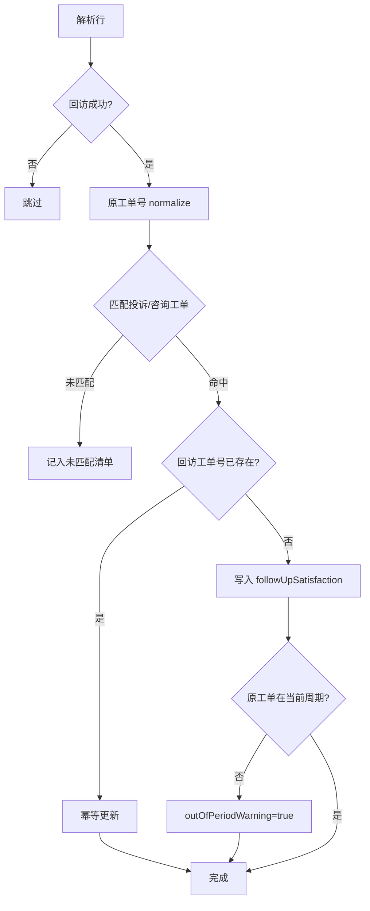

# 用后即评 · 满意度回访记录

> 用后即评总设计：[DESIGN-用后即评.md](./DESIGN-用后即评.md)  
> 任务分解：[TASKS-用后即评-满意度回访.md](./TASKS-用后即评-满意度回访.md)  
> 状态：**已实现**（P0–P6，2026-06-05）

本文只描述投诉闭环后的 **满意度回访记录**：导入、工单补全、反馈库展示与导出 round-trip。短信 / 官网问卷、工作台故事页与 HTML 月报以总设计为准。投诉回访 KPI 已并入用后即评故事模型，不再单独挂「回访满意度」面板。

---

## 1. 背景与定位

### 1.1 三类用户即评数据

| 子类型 | 说明 | 本期 |
|--------|------|------|
| 满意度回访记录 | 投诉闭环后电话/工单回访报表 | **实现** |
| 官网渠道问卷 | 待设计 | 否 |
| 短信渠道问卷 | 待设计 | 否 |

### 1.2 与现有 `post_use_rating` 的区别

系统已有 `dataSourceType: post_use_rating`，用于 **渠道评价明细**（短信 / 控制台评分等，`ratingScore`）。

**满意度回访（投诉处理-电话回访）** 的呈现规则：

- 双文件导入时，回访行仍参与渠道口径 KPI（对内满意度 / 对外混算），并可写入 `post_use_rating`（`channel=callback`）供指标计算；
- **反馈库「用后即评」列表不展示** 独立回访行；回访信息 **补全（enrichment）** 到已存在的 **投诉 / 咨询工单** 上，在反馈库以工单回访满意度列呈现；
- 工作台「用后即评」Tab：**渠道口径** 表用于月报一致 KPI；**回访满意度** 模块基于「有回访信息的工单子集」下钻，并披露未匹配原工单条数。

（历史约定「完全不写 post_use_rating」已调整为「可写库、反馈库过滤」，避免与月报三渠道口径冲突。）

### 1.3 反馈库双通道（下一阶段）

- **投诉咨询工单**（`lane=tickets`）与 **用后即评**（`lane=post_use`）分列：后者仅展示短信/控制台评价明细（不含投诉回访独立行）。
- **非 10 分** 评价可补 **用户旅程**（规则关键词，`enrichPostUseJourney`），不走工单批量打标。
- **客服回访**：支持 Excel 批量导入（`subType=customer_visit`）写入 `visit_records` 并软匹配挂到评价明细的 `customerVisit`；工作台亦支持单条补录。

---

## 2. 已定业务规则

| 议题 | 结论 |
|------|------|
| 补全范围 | **投诉 + 咨询** 工单均支持，按「原工单号」匹配 |
| 同一原工单多次回访 | **不存在**；不做详情历史折叠 |
| 同一回访工单号重复导入 | **幂等更新**（覆盖），不 duplicate |
| 同一原工单被不同回访工单号覆盖 | 以 **最后一次导入** 为准；摘要报告覆盖数 |
| 月度粒度（趋势/分组） | **导入时选择的月份**（`importMonth`）→ 若无则 **原工单 `importMonth`** → 仍无则「未知月份」 |
| 周期 | 导入绑定当前 `insightPeriodId`；原工单不在该周期 → **仍补全**，设 `outOfPeriodWarning: true` |
| 列表筛选 | 支持：有/无回访、10 分/非 10 分、已解决/未解决 |
| 不满意原因分析 | **结构化 7+1 子维度** 统计，不对汇总长文本做关键词 |
| 图表下钻 | 非 10 分等模块可 **跳转反馈库** 并预填筛选 |
| 导出 Sheet | 按 **数据来源 + 月份** 分 sheet（如 `投诉工单-2026年05月`） |

---

## 3. 数据模型

### 3.1 工单上的回访字段

挂载于 `TicketRecord` / `FeedbackRecord`（仅 `complaint_ticket`、`consultation_ticket`）：

```text
followUpSatisfaction?: {
  followUpTicketId       // 回访工单编号（幂等键）
  score                  // 1–10 整数
  problemResolved        // 'resolved' | 'unresolved' | null
  dissatisfiedReasons    // 汇总文本（列表/详情/导出展示）
  dissatisfiedReasonParts // 结构化子维度（分析用，见 §3.2）
  remark                 // 备注
  followUpSuccessful     // boolean；仅 true 参与匹配后的展示与指标
  importMonth            // YYYY-MM；导入所选月份，趋势主键
  sourceSubType          // 'satisfaction_callback'（预留 web_survey / sms_survey）
  importBatchId
  importedAt
}
```

### 3.2 不满意原因结构化（`dissatisfiedReasonParts`）

报表列 → 字段映射：

| 字段 key | 报表列名 |
|----------|----------|
| `overallService` | 整体服务情况不满意原因 |
| `handlingDurationScore` | 请您对问题处理时长进行评价 |
| `handlingDurationReason` | 处理时长不满意原因 |
| `staffAttitudeScore` | 请您对服务人员的服务态度进行评价 |
| `staffAttitudeReason` | 服务人员的服务态度不满意原因 |
| `staffCapabilityScore` | 请您对服务人员的业务能力进行评价 |
| `staffCapabilityReason` | 服务人员的业务能力不满意原因 |
| `phoneCallbackOpinion` | 电话回访意见 |

- **展示用** `dissatisfiedReasons`：上述非空列拼接（去重、分隔符统一）。
- **分析用**：各维非空/低分条目计数，驱动工作台「不满意原因分布」条形图。

### 3.3 展示格式

| 场景 | 格式 |
|------|------|
| 反馈库列表「回访满意度」 | `10（已解决）` / `7（未解决）` / `—` |
| 工单详情 | 「是否加急」后：评分 + 是否解决；「用户请求」上方：不满意原因（汇总文本） |

---

## 4. 导入（第 1 步）

### 4.1 入口

导入页 **独立流程**（与投诉/咨询工单导入分离）：

> 导入满意度回访记录 → 选择 **洞察周期 + 回访月份** → 上传 Excel → 预览 → 确认合并

- 占用 **`import` 全局锁**，与工单导入、批量打标互斥。
- 记操作审计（建议 action：`follow_up_satisfaction.import`）。

### 4.2 列映射

| 系统字段 | 报表列名 |
|----------|----------|
| 回访工单号 | 回访工单编号 |
| 原工单号 | 原工单编号 |
| 产品（辅助校验） | 具体投诉产品 |
| 是否回访成功 | 是否回访成功 |
| 问题是否解决 | 之前您反映的问题是否得到解决 |
| 评分 | 请您对本次投诉的整体服务情况进行评价 |
| 不满意原因（各维 + 汇总） | 见 §3.2 |
| 备注 | 备注 |

### 4.3 行处理逻辑



1. `是否回访成功 ≠ 是`（含同义词：是/成功/Y/1 等）→ 跳过。
2. `原工单号` 经 `normalizeTicketId` 后匹配库内工单（投诉、咨询均查）。
3. 产品列与命中工单产品不一致 → **警告**，不阻断。
4. `importMonth` = 用户导入所选月份；写入 `followUpSatisfaction.importMonth`。
5. `followUpTicketId` 相同 → **覆盖更新**（幂等）。

### 4.4 导入摘要

展示：成功补全数、未匹配数、跳过（非成功）数、周期外补全数、覆盖更新数；支持下载未匹配 CSV。

---

## 5. 工单补全与展示（第 2 步）

### 5.1 反馈库列表

- 在 **「数据来源」** 列后增加 **「回访满意度」** 列。
- **筛选**（采纳）：
  - 有回访 / 无回访
  - 10 分 / 非 10 分
  - 已解决 / 未解决

### 5.2 工单详情

- **是否加急** 后：**回访满意度**（评分 + 问题是否解决）。
- **用户请求** 上方：**不满意原因**（汇总文本，只读）。

### 5.3 Field Registry

在 **「是否加急」**（`importOrder` / `exportOrder` 10）后插入：

| fieldKey | displayName | applicableSources |
|----------|-------------|-------------------|
| `followUpSatisfaction` | 回访满意度 | `complaint_ticket`, `consultation_ticket` |
| `followUpDissatisfiedReasons` | 不满意原因 | 同上 |

- 分析结果导出版本递增至 **v3**（或 v2 小版本 bump，实现时统一）。
- 其后字段 `exportOrder` / `importOrder` 顺延。

### 5.4 导出分析结果

- 列：在「是否加急」后增加「回访满意度」「不满意原因」。
- **Sheet 规则（已定）**：按 **数据来源 + importMonth** 分 sheet。  
  示例：`投诉工单-2026年05月`、`咨询工单-2026年05月`；无月份 → `投诉工单-未知月份`。

### 5.5 导入分析结果（round-trip）

- 模板在「是否加急」后增加「回访满意度」「不满意原因」，**允许为空**。
- 解析 `10（已解决）` 或等价分列写法；**仅 patch 回访字段**，不触发全量 LLM 重打标。

---

## 6. 工作台分析（第 3 步）

模块位置：洞察工作台 → **用后即评** Tab → **回访满意度**（可逐步替换现有 Stub 占位内容）。

### 6.1 数据范围

当前所选 **洞察周期** 内，满足：

- `followUpSatisfaction.followUpSuccessful === true`
- 有效 `score`

### 6.2 指标与图表

| 模块 | 计算 | 说明 |
|------|------|------|
| **10 分满意率月度趋势** | 每月：`score===10 数 / 回访成功且有评分数` | 多产品折线；**88% 基线**（可配置，二期） |
| **非 10 分 · 得分分布** | 1–9 分各计数 | 分产品；**≤5 分标红** |
| **请求场景分布** | 非 10 分工单 | 条形图 |
| **问题类型分布** | 非 10 分工单 | 条形图 |
| **不满意原因分布** | `dissatisfiedReasonParts` 各维 | 条形图 |
| **未解决数量及占比** | `problemResolved === unresolved` | Statistic + 占比 |

- **月度聚合**：使用 §2 已定规则（导入月份 → fallback 原工单 importMonth）。
- **产品联动**：顶部选择产品后，后 4 项（及非 10 分相关块）数据联动过滤。
- **Drill-down**：图表/指标 → 跳转 `/feedbacks` 并预填：非 10 分、产品、场景/类型/原因等筛选。

### 6.3 快照与性能

- 在 `post_use_rating` 来源快照构建时预聚合回访指标（`followUpSatisfactionAnalytics`），避免 Tab 打开时全量扫描。
- 与现有 `PostUseRatingDashboardView` / Stub Pipeline 解耦：分析读 **工单 enrichment**，不读 standalone `post_use_rating` 记录。

---

## 7. 实现索引

| 职责 | 文件 |
|------|------|
| 领域类型与校验 | `src/domain/followUpSatisfaction.js` ✅ |
| 报表解析与匹配 | `src/lib/followUpSatisfactionImport.js` ✅ |
| 导入 API | `server/routes/storage.js` → `POST /api/storage/follow-up-satisfaction/import` ✅ |
| 列预设 | `src/lib/columnPresets.js`（`SATISFACTION_CALLBACK_PRESET`）✅ |
| 分析聚合 | `src/lib/followUpSatisfactionAnalytics.js` ✅ |
| Field Registry | `src/domain/fieldRegistry.js` ✅ |
| 导出 v3 / Sheet 分组 | `src/lib/ticketAnalysisExport.js` ✅ |
| 导入 round-trip | `src/lib/importAnalysis.js`、`src/domain/overridePolicy.js` ✅ |
| 列表/详情/筛选 | `FeedbackTable.jsx`、`FeedbackDrawer.jsx`、`Feedbacks.jsx`、`feedbackFilters.js` ✅ |
| 导入 UI | `FollowUpSatisfactionImportPanel.jsx`、`ImportHub.jsx` ✅ |
| 工作台模块 | `FollowUpSatisfactionPanel.jsx`、`PostUseRatingDashboardView.jsx` ✅ |
| 快照预聚合 | `src/snapshots/buildSourceSnapshot.js`、`snapshotService.js` ✅ |
| 测试 / UAT | `docs/TEST-PLAN.md` TAG-FU、`docs/FOLLOW-UP-SATISFACTION-UAT.md` ✅ |

---

## 8. 测试要点

- 回访成功/失败过滤、原工单号 normalize 匹配（投诉+咨询）。
- 幂等：同回访工单号更新；不同回访工单号覆盖同一原工单。
- `importMonth` 与 fallback 原工单月份；未知月份不参与趋势或单独 bucket。
- 周期外补全 + `outOfPeriodWarning`。
- 结构化不满意原因 → 分布图计数。
- 10 分率分母 = 回访成功且有评分（非全库工单）。
- 导出 Sheet：来源+月份；导入 round-trip 回访列。
- 列表筛选与 drill-down URL 参数。

---

## 9. 变更记录

| 日期 | 说明 |
|------|------|
| 2026-06-05 | 初稿：定稿导入补全、月度规则、Field Registry、工作台分析、导出 Sheet 规则 |
| 2026-06-05 | **P0 完成**：`followUpSatisfaction.js`、Field Registry 两列、存储 patch 单测 |
| 2026-06-05 | **P1 完成**：`followUpSatisfactionImport.js`、导入 API、`FollowUpSatisfactionImportPanel` |
| 2026-06-05 | **P2 完成**：`FeedbackTable`/`FeedbackDrawer` 展示、`feedbackFilters.js` URL 筛选 |
| 2026-06-05 | **P3 完成**：`EXPORT_ANALYSIS_VERSION=3`、来源+月份 sheet、回访 round-trip 导入 |
| 2026-06-05 | **P4 完成**：`followUpSatisfactionAnalytics.js`、post_use_rating 快照预聚合 |
| 2026-06-05 | **P5 完成**：工作台回访满意度面板、88% 基线趋势、非 10 分下钻 |
| 2026-06-05 | **P6 完成**：TEST-PLAN TAG-FU-08～18、集成测、UAT 清单 |
| 2026-08-01 | 补充 §1.3：反馈库双通道、非 10 分旅程、客服回访导入 |
