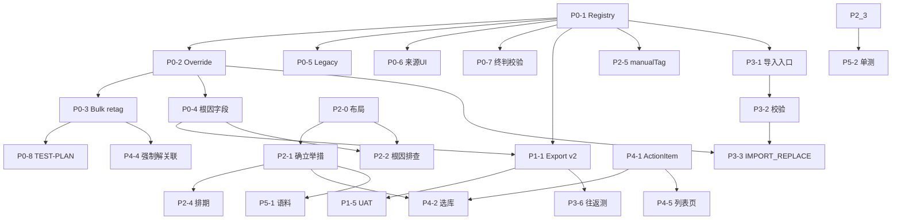

# 任务分解 · 需求 @20260601-1

> **设计依据**：[DESIGN-20260601-1.md](./DESIGN-20260601-1.md)  
> **产品需求**：[data/需求@20260601-1.md](../data/需求@20260601-1.md)  
> 状态：可排期执行清单（**不含实现**）  
> 最后更新：2026-06-01

---

## 1. 如何使用

| 列 / 字段 | 含义 |
|-----------|------|
| **ID** | 唯一任务编号，便于 PR / Issue 引用 |
| **估时** | 单人日（d），含自测；不含 UAT 缓冲 |
| **依赖** | 必须先完成的任务 ID |
| **涉及文件** | 主要改动点，非穷尽 |
| **验收** | 完成判定标准 |

**建议迭代**：P0 → P1 → P2 → P3 → P4；P5 与 P2 收尾并行。  
**已落地基线**（不再排任务）：全局后台锁、列映射 rename、咨询终判导出 fix。

---

## 2. 里程碑总览

| 里程碑 | Phase | 目标 | 估时合计 | 出口标准 |
|--------|-------|------|----------|----------|
| M0 治理就绪 | P0 | Field Registry + Override 统一 | ~8d | 强制覆盖全 scope 一致；legacy 停写 |
| M1 可导出 | P1 | 导出 v2 列 | ~4d | 17 列顺序正确；退役列移除 |
| M2 可编辑 | P2 | 工单详情改版 | ~8d | A→B→C→D 布局；新字段可存 |
| M3 可往返 | P3 | 导入分析结果 | ~7d | 导出→改→导入一致；R3 跳过未匹配 |
| M4 举措闭环 | P4 | 举措库 + 举措与进展 | ~14d | 选库/入库/列表/预警 |
| M5 聚类对齐 | P5 | 语料规则落地 | ~2d | getEffectiveOptimization + 单测 |

**全量估时**：约 **43 人日**（1 人约 9 周；2 人并行 P2/P1 约 5–6 周至 M3）。

---

## 3. Phase P0 · 基础治理与快速修复（~8d）

> **目标**：所有后续模块共用 Field Registry 与 Override Policy；修复已知打标缺口。

### P0-1 · Field Registry v1（1.5d）✅

**状态**：已完成（2026-06-01）  
**交付**：`src/domain/fieldRegistry.js`、`src/domain/fieldRegistry.test.js`；`types.js` JSDoc 对齐

| # | 子任务 |
|---|--------|
| 1 | 定义 `FieldDefinition` 类型与 `FIELD_REGISTRY` 常量（含 §2.2 全部 export/import 字段） |
| 2 | 导出 `getExportColumns()`、`getImportColumns()`、`getFieldByKey()` |
| 3 | 标注 `legacy: true` 字段（manualReview* 三字段、问题摘要等） |
| 4 | 标注 `clusterRole`、`manualDimension`、`provenanceField` |
| 5 | 单测：列序、咨询/投诉 applicableSources、legacy 过滤 |

**验收**：Registry 为导出/导入/Override 唯一字段来源；单测绿。

---

### P0-2 · Override Policy 模块（1.5d）✅

**状态**：已完成（2026-06-01）  
**交付**：`src/domain/overridePolicy.js`、`src/domain/overridePolicy.test.js`

| # | 子任务 |
|---|--------|
| 1 | 实现 `applyOverridePolicy(record, policy, scope)`，`policy ∈ {RESPECT_MANUAL, FORCE_ALL_HUMAN, IMPORT_REPLACE}` |
| 2 | `FORCE_ALL_HUMAN`：清 manualTagFields、确立举措文本、actionId（P4 前 actionId 可 noop）、legacy 三字段、产品组/设计师（字段存在时） |
| 3 | `FORCE_ALL_HUMAN`：**根因排查回退** `sourceColumns['问题原因']` \|\| `rootCause` |
| 4 | `IMPORT_REPLACE`：按 Registry importable 字段写入；空串覆盖；满标 manualTagFields；来源记 `import` |
| 5 | `RESPECT_MANUAL`：透传 + 现有 preserveManualTags 语义 |
| 6 | 单测覆盖三策略 + 根因回退 |

**验收**：策略逻辑集中在一处；manualTagFields.js 可薄封装调用（下一步 P0-3）。

---

### P0-3 · 批量打标强制覆盖行为统一（2d）✅

**状态**：已完成（2026-06-01）

### P0-4 · 根因排查字段（数据层）（1d）✅

**状态**：已完成（2026-06-01）  
**交付**：`src/domain/rootCauseReview.js`、`rootCauseReview.test.js`；`recordFactory`、manualTagFields 扩展

### P0-5 · Legacy 三字段停止写入（0.5d）✅

**状态**：已完成（2026-06-01）  
**说明**：`recordFactory` 新建记录 legacy 三字段恒空；导出列保留至 P1 移除

### P0-6 · 导入来源 Tag = 人工（0.5d）✅

**状态**：已完成（2026-06-01）

### P0-7 · 终判完整性校验（咨询豁免）（0.5d）✅

**状态**：已完成（2026-06-01）

### P0-8 · 回归测试清单（0.5d）✅

**状态**：已完成（2026-06-01）  
**交付**：`docs/TEST-PLAN.md` §5.4.3a TAG-M0

---

### P0-3 · 批量打标强制覆盖行为统一（2d）— 归档说明

**依赖**：P0-2  
**涉及文件**：`src/lib/manualTagFields.js`、`src/lib/pipeline.js`、`src/context/InsightsContext.jsx`、`src/hooks/useBulkRetagModal.jsx`

| # | 子任务 |
|---|--------|
| 1 | `applyForceRetagOverrides` 改为委托 `overridePolicy`（或内联同等逻辑 + 根因回退） |
| 2 | **修复 scope 缺口**：`needs_ticket_llm` / `needs_journey_llm` 在 `forceOverrideManualTags` 时也对每条记录先 apply FORCE，再进 LLM（现网 `retagged = [...list]` 跳过清空） |
| 3 | `reprocessFeedbackRecord`：强制覆盖后不再把 legacy 复核字段从 **原** record 抄回（现 168–171 行会覆盖清空结果，需改） |
| 4 | 更新 `useBulkRetagModal` 弹窗文案为设计 §3.5 v2 |
| 5 | 单测：`manualTagFields.test.js` 增补根因回退、actionId 清空（占位） |
| 6 | 集成测：三 scope × 强制覆盖/on |

**验收**：补打/补打旅程/全量 + 强制覆盖行为一致；弹窗文案与 DESIGN 一致。

---

### P0-4 · 根因排查字段（数据层）（1d）

**依赖**：P0-2  
**涉及文件**：`src/lib/types.js`、`src/domain/records.js`、`src/lib/recordFactory.js`、`src/lib/manualTagFields.js`（merge 规则）

| # | 子任务 |
|---|--------|
| 1 | 新增 `rootCauseReview?: string`（或 Registry 约定键名） |
| 2 | recordFactory 默认值；详情未编辑时导出可读 `sourceColumns['问题原因']` \|\| `rootCause` 的 **effective**  helper |
| 3 | `mergeManualTagFieldsOnUserEdit`：编辑 rootCauseReview 是否标人工（建议单独维度或归入 note 外字段，在 Registry 注明） |
| 4 | 单测：effective 默认值、强制覆盖回退写入 |

**验收**：字段可持久化；FORCE 后回退值正确；P2 UI 可直接绑定。

---

### P0-5 · Legacy 三字段停止写入（0.5d）

**依赖**：P0-1  
**涉及文件**：`src/components/FeedbackDrawer.jsx`、`src/lib/export.js`、`src/lib/ticketAnalysisExport.js`、`src/lib/pipeline.js`、`src/lib/recordFactory.js`

| # | 子任务 |
|---|--------|
| 1 | 移除详情/保存对 manualReviewRootCause/Solution/Action 的读写 UI（若仍有） |
| 2 | 导出仍保留列过渡期：标记 deprecated，P1 移除 |
| 3 | pipeline 强制覆盖路径不再恢复三字段 |
| 4 | grep 全库确认无新增写入 |

**验收**：新保存记录三字段恒空；强制覆盖仍清空。

---

### P0-6 · 导入来源 Tag = 人工（0.5d）

**依赖**：P0-1  
**涉及文件**：`src/lib/ticketAnalysis/ticketAnalysisSources.js`、`src/components/tags/TicketAnalysisSourceTag.jsx`

| # | 子任务 |
|---|--------|
| 1 | 来源枚举支持 `import`；映射 UI 文案 **「人工」**（与 `manual` 同显） |
| 2 | `getTicketAnalysisSourceLabel` / `getOptimizationSourceLabel` 更新 |
| 3 | 单测：source=import/manual → 人工 |

**验收**：R2；LLM/规则不受影响。

---

### P0-7 · 终判完整性校验（咨询豁免）（0.5d）

**依赖**：P0-1  
**涉及文件**：`src/lib/sourceColumns.js`、`src/lib/sourceColumns.test.js`

| # | 子任务 |
|---|--------|
| 1 | `hasIncompleteSourceColumns`：咨询工单不要求终判三列 |
| 2 | `recordsMissingSourceColumns` 同步 |
| 3 | 单测：投诉缺列=true，咨询缺终判=false |

**验收**：咨询单不再触发「来源列不完整」误报。

---

### P0-8 · 回归测试清单（0.5d）

**依赖**：P0-3, P0-7  
**涉及文件**：`docs/TEST-PLAN.md`

| # | 子任务 |
|---|--------|
| 1 | 增补 TAG-override-scope、TAG-终判-consultation、TAG-import-source-ui |
| 2 | 链接 TASKS / DESIGN |

**验收**：TEST-PLAN 可指导 P0 UAT。

---

## 4. Phase P1 · 导出 v2（~4d）

### P1-1 · recordToExportRowV2（2d）✅

**状态**：已完成（2026-06-01）  
**交付**：`recordToExportRowV2`、`getExportV2Headers`；`downloadTicketAnalysisExcel` 已切 v2；`ticketAnalysisExport.test.js`

### P1-1 · recordToExportRowV2（2d）— 归档说明

**依赖**：P0-1, P0-4  
**涉及文件**：`src/lib/ticketAnalysisExport.js`、`src/lib/ticketAnalysisExport.test.js`

| # | 子任务 |
|---|--------|
| 1 | `recordToExportRowV2(r)` 仅读 Field Registry 列序 |
| 2 | 映射：确立举措 ← `manualReviewOptimization`（过渡）/ 未来 `establishedAction` |
| 3 | 排期、根因排查：读新字段 + effective helper |
| 4 | 受理内容/处理意见：复用现有 extract 逻辑 |
| 5 | 不输出来源三列、legacy 列、退役列 |
| 6 | 加急/情绪中文文案 |
| 7 | 单测：列序、咨询无终判、空值 |

**验收**：导出 Excel 头与需求 §一.4 一致（17 列）。

---

### P1-2 · 退役列与用户说明（0.5d）✅

**状态**：已完成（2026-06-01）  
**交付**：[`docs/EXPORT-V2-MIGRATION.md`](./EXPORT-V2-MIGRATION.md)；`EXPORT_ANALYSIS_VERSION=2`；反馈库导出入口 v2 + Tooltip

### P1-2 · 退役列与用户说明（0.5d）— 归档说明

**依赖**：P1-1  
**涉及文件**：`docs/EXPORT-V2-MIGRATION.md`、`src/lib/ticketAnalysisExport.js`、`src/pages/Feedbacks.jsx`

| # | 子任务 |
|---|--------|
| 1 | 旧列 → 新列对照表 |
| 2 | Feedbacks 导出入口切 v2（或开关 `exportAnalysisV2` 默认开） |

**验收**：产品可对照旧模板迁移。

---

### P1-3 · 确立举措列过渡（0.5d）

**依赖**：P1-1  
**涉及文件**：`src/lib/ticketAnalysisExport.js`

| # | 子任务 |
|---|--------|
| 1 | 确立举措优先 `establishedAction`，fallback `manualReviewOptimization` |

**验收**：旧数据导出不为空。

---

### P1-3 · 确立举措列过渡（0.5d）✅

**状态**：已完成（含于 P1-1 `readFieldValue` fallback）

### P1-4 · 排期/根因占位（0.5d）✅

**状态**：已完成（2026-06-01）  
**验收**：`ticketAnalysisExport.uat.test.js` P1-4 专项 + 往返测

### P1-5 · 导出 UAT（0.5d）✅

**状态**：已完成（2026-06-01）  
**交付**：[`docs/EXPORT-V2-UAT.md`](./EXPORT-V2-UAT.md)、`exportV2UatSamples.js`（20 条）、`ticketAnalysisExport.uat.test.js`（9 项自动化）

### P1-4 · 排期/根因占位（0.5d）— 归档说明

**依赖**：P0-4, P1-1  

| # | 子任务 |
|---|--------|
| 1 | 无排期导出空单元格（R1） |
| 2 | 无 rootCauseReview 时导出 effective 默认 |

**验收**：与需求 §三导入校验可往返。

---

### P1-5 · 导出 UAT（0.5d）

**依赖**：P1-1  

| # | 子任务 |
|---|--------|
| 1 | 投诉/咨询各 10 条抽样人工核对 |
| 2 | 记录样例文件于 `docs/` 或测试 fixtures |

**验收**：UAT 签字项可勾选。

---

### P1-R5 · 历史数据 migration（可选，1d）

**依赖**：P1-1  
**状态**：R5 待办，**非阻塞 M1**

| # | 子任务 |
|---|--------|
| 1 | 脚本：`manualReviewOptimization` → `establishedAction` 副本 |
| 2 | legacy 根因 → `rootCauseReview`（若有值） |
| 3 | 只读预览 + dry-run |

---

## 5. Phase P2 · 工单详情改版（~8d）

### P2-0 · 布局重排（1d）✅

**依赖**：—  
**状态**：已完成（2026-06-01）  
**涉及文件**：`src/components/FeedbackDrawer.jsx`、`FeedbackDrawer.layout.test.js`

| # | 子任务 |
|---|--------|
| 1 | 保持 A meta → B1 工单分类 → B2 终判 |
| 2 | **处理意见 Card 下移至 D**（客户请求/痛点/优化之上或之下按线框：C 在前 D 在后） |
| 3 | 顺序：A → B1 → B2 → C（客户请求、痛点、优化）→ D（处理意见、根因、备注） |
| 4 | 无功能变更，仅 DOM 顺序；快照/视觉回归 |

**验收**：§3.1 线框；B 区仍在最上。

---

### P2-1 · 确立举措模块（1.5d）✅

**依赖**：P0-1, P2-0  
**状态**：已完成（2026-06-01）  
**涉及文件**：`FeedbackDrawer.jsx`、`src/domain/establishedAction.js`、`src/lib/types.js`

| # | 子任务 |
|---|--------|
| 1 | 「人工复核后的优化建议」改名为 **确立举措** |
| 2 | 1000 字限制；state `establishedAction`（过渡可双写 manualReviewOptimization） |
| 3 | 保存走 updateFeedback + manualTagFields optimization |
| 4 | P4 前：仅输入，无选库 |

**验收**：编辑保存后导出列「确立举措」有值。

---

### P2-2 · 根因排查（1d）✅

**依赖**：P0-4, P2-0  
**状态**：已完成（2026-06-01）  
**涉及文件**：`FeedbackDrawer.jsx`、`src/domain/rootCauseReview.js`

| # | 子任务 |
|---|--------|
| 1 | D 区新增根因排查 TextArea，默认 effective 值 |
| 2 | 保存 `rootCauseReview`；首次打开未编辑显示默认 |
| 3 | 1000 字限制 |

**验收**：与导出列根因排查一致；FORCE 回退后可再编辑。

---

### P2-3 · 产品组/设计师建议（1d）✅

**依赖**：P0-1, P2-0  
**状态**：已完成（2026-06-01）  
**涉及文件**：`FeedbackDrawer.jsx`、`src/domain/detailOptimizationFields.js`、`types.js`

| # | 子任务 |
|---|--------|
| 1 | 新字段 `productGroupOptimization`、`designerOptimization` |
| 2 | C 区优化 Card 内，自动优化下方 |
| 3 | Registry 标记 clusterRole=none |

**验收**：可存可导出；不参与聚类（P5-2 断言）。

---

### P2-4 · 排期字段（1d）✅

**依赖**：P2-1  
**状态**：已完成（2026-06-01）  
**涉及文件**：`FeedbackDrawer.jsx`、`src/domain/actionSchedule.js`、`types.js`

| # | 子任务 |
|---|--------|
| 1 | `actionSchedule` 日期/字符串字段；**可空**（R1） |
| 2 | 与确立举措同 Card；P4 前手动可编辑 |
| 3 | 导出/保存联动 |

**验收**：空排期允许保存；导出空单元格。

---

### P2-5 · manualTagFields 扩展（1d）✅

**依赖**：P0-1  
**状态**：已完成（2026-06-01）  
**涉及文件**：`manualTagFields.js`、`FeedbackDrawer.jsx`、`src/domain/ticketAnalysisManualFields.js`

| # | 子任务 |
|---|--------|
| 1 | 新维度：`customerRequest`、`painPoint`（及确立举措已有 optimization） |
| 2 | `mergeManualTagFieldsOnUserEdit` 扩展 |
| 3 | `preserveManualTags` / bulk retag 尊重新维度 |
| 4 | 单测更新 |

**验收**：详情改客户请求后 bulk retag 默认保留。

---

### P2-6 · 来源 Tag 规则（0.5d）✅

**依赖**：P0-6, P2-1  
**状态**：已完成（2026-06-01）  
**涉及文件**：`ticketAnalysisSources.js`、`TicketAnalysisSourceTag.jsx`、`export.js`、`ticketAnalysisExport.js`

| # | 子任务 |
|---|--------|
| 1 | 有确立举措 → OptimizationSourceTag 人工 |
| 2 | import/manual 来源 → 人工 |

**验收**：与 DESIGN §3.1 一致。

---

### P2-7 · 工单详情 UAT（1d）✅

**依赖**：P2-0～P2-6  
**状态**：已完成（2026-06-01）  
**交付**：[`docs/FEEDBACK-DRAWER-UAT.md`](./FEEDBACK-DRAWER-UAT.md)、`detailDrawerUatSamples.js`、`FeedbackDrawer.uat.test.js`

| # | 子任务 |
|---|--------|
| 1 | 投诉/咨询各 5 条：布局、编辑、保存、重开 |
| 2 | canEdit=false 只读路径 |

**验收**：TEST-PLAN 详情项通过。

---

## 6. Phase P3 · 导入分析结果（~7d）

### P3-1 · 入口与页面（1.5d）✅

**依赖**：P0-1  
**状态**：已完成（2026-06-01）  
**涉及文件**：`ImportHub.jsx`、`ImportAnalysis.jsx`、`importAnalysisTemplate.js`、`router.jsx`

| # | 子任务 |
|---|--------|
| 1 | 与「导入工单 Excel」分 Tab 或分路由 |
| 2 | 说明文案：仅更新已存在工单（R3） |
| 3 | 模板下载（v2 表头 18 列，与导出一致） |

**验收**：用户可区分两种导入。

---

### P3-2 · 解析与列校验（1.5d）

**依赖**：P3-1  
**涉及文件**：新建 `src/lib/importAnalysis.js`、`importAnalysis.test.js`；复用 `parseFile.js`

| # | 子任务 |
|---|--------|
| 1 | 表头匹配 Registry import 列；多余列忽略 |
| 2 | 必填校验（**排期除外**，R1） |
| 3 | 情绪/加急枚举解析 |
| 4 | 行级错误收集 |

**验收**：非法文件友好报错；排期空行通过校验。

---

### P3-3 · IMPORT_REPLACE 写入（2d）

**依赖**：P0-2, P3-2  
**涉及文件**：`importAnalysis.js`、`InsightsContext.jsx` 或 storage 层

| # | 子任务 |
|---|--------|
| 1 | ticketId 匹配库内记录；**未匹配跳过** + 汇总 `skippedUnknownTicketIds`（R3） |
| 2 | 空单元格覆盖线上值 |
| 3 | 调用 `applyOverridePolicy(..., IMPORT_REPLACE)` |
| 4 | bumpDataRevision |
| 5 | 单测：覆盖、清空、跳过 |

**验收**：R3；不影响未出现在表中的工单。

---

### P3-4 · manualTagFields + 来源（0.5d）

**依赖**：P3-3, P0-6  

| # | 子任务 |
|---|--------|
| 1 | 导入后来源字段 = import |
| 2 | manualTagFields 满标 import 涉及维度 |

**验收**：详情 Tag 显示人工。

---

### P3-5 · 全局锁接入（0.5d）

**依赖**：已有 `backgroundTaskLock`  
**涉及文件**：`InsightsContext.jsx`、`ImportAnalysis` 页面

| # | 子任务 |
|---|--------|
| 1 | 导入分析 acquire/release `import` 锁 |
| 2 | 与 bulk retag 互斥 UI 提示 |

**验收**：并发导入/打标 blocked。

---

### P3-6 · 导出↔导入往返测试（1d）

**依赖**：P1-1, P3-3  
**涉及文件**：`src/lib/importAnalysis.test.js` 或 e2e fixture

| # | 子任务 |
|---|--------|
| 1 | fixture：导出 v2 → 改若干列 → 导入 → 断言 record |
| 2 | 未匹配工单号样例 |
| 3 | 排期空样例 |

**验收**：往返 diff 为零（除 import 元数据）。

---

## 7. Phase P4 · 举措库与举措与进展（~14d）

### P4-1 · 数据层与 API（3d）

**依赖**：—  
**涉及文件**：`server/businessDb.js`、`server/routes/actions.js`（新建）、`server/storageRepository.js`、`src/storage/*`

| # | 子任务 |
|---|--------|
| 1 | 表 `action_items` schema（§3.4） |
| 2 | Repository：CRUD、按 product/status/时间筛选 |
| 3 | `GET/POST/PATCH/DELETE /api/actions` |
| 4 | 客户端 adapter 方法 |
| 5 | 单测 / API 测 |

**验收**：可通过 API 创建举措并列表查询。

---

### P4-2 · 确立举措选库 UI（2d）

**依赖**：P4-1, P2-1  
**涉及文件**：`FeedbackDrawer.jsx`、新建 `ActionItemSelect.jsx`

| # | 子任务 |
|---|--------|
| 1 | SearchSelect：content + status 展示 |
| 2 | 选择后写 `actionId` + 文本副本（R4） |
| 3 | 排期只读来自库 |

**验收**：选库后 actionId 持久化；导出文本副本一致。

---

### P4-3 · 手动输入自动入库（2d）

**依赖**：P4-1, P2-1  

| # | 子任务 |
|---|--------|
| 1 | 保存时 upsert ActionItem（首单关联） |
| 2 | 写 actionId；painPoint/问题类型/旅程 snapshot |
| 3 | 排期空 → 状态待评估；有排期 → 进行中 |

**验收**：新举措出现在举措库。

---

### P4-4 · 强制覆盖解关联（1d）

**依赖**：P0-3, P4-1  

| # | 子任务 |
|---|--------|
| 1 | FORCE 清 actionId + 文本；ActionItem 不 DELETE |
| 2 | linkedTicketIds 移除本工单（可选 API） |
| 3 | 单测 |

**验收**：库记录仍在；工单侧无关联。

---

### P4-5 · 举措与进展列表页（3d）

**依赖**：P4-1  
**涉及文件**：新建 `src/pages/Actions.jsx`、`AppShell` 导航

| # | 子任务 |
|---|--------|
| 1 | 筛选：产品、状态、首次提出时间、关联工单 |
| 2 | 统计卡片：待评估/进行中/已完成/挂起 |
| 3 | 列表列：§四.3 全部字段 |
| 4 | 分页 |
| 5 | 关联工单 hover 列表 + 复制 |

**验收**：需求 §四.1–3 可视。

---

### P4-6 · 行操作（2d）

**依赖**：P4-5  

| # | 子任务 |
|---|--------|
| 1 | 改状态 / 改内容 / 改排期 |
| 2 | 排期变更 → `scheduleChanged` 标签 |
| 3 | 同步刷新已关联工单文本副本（R4，可选异步） |

**验收**：§四.4 操作可用。

---

### P4-7 · 超时预警（1d）

**依赖**：P4-5  

| # | 子任务 |
|---|--------|
| 1 | 待评估：15d 橙、30d 红 |
| 2 | 进行中：排期前 15d 橙、过期红 |
| 3 | 状态切换清预警 |
| 4 | 单测日期边界 |

**验收**：§四.5 规则。

---

### P4-8 · 首单字段 sync（1d）

**依赖**：P4-1  

| # | 子任务 |
|---|--------|
| 1 | 首单 painPoint/问题类型/旅程变更时更新 ActionItem snapshot |
| 2 | 策略：仅首单 sync 或显式开关 |

**验收**：需求「并可随其同步更新」。

---

## 8. Phase P5 · 聚类与行动建议对齐（~2d）

### P5-1 · getEffectiveOptimization（0.5d）

**依赖**：P2-1  
**涉及文件**：`src/lib/ticketAnalysis/ticketOptimizationExtract.js`

| # | 子任务 |
|---|--------|
| 1 | 优先 `establishedAction` / manualReviewOptimization |
| 2 | 无则 product/service 自动 |

**验收**：与 §五 一致。

---

### P5-2 · 语料排除单测（0.5d）

**依赖**：P2-3  
**涉及文件**：`ticketOptimizationExtract.test.js`、`effectiveOptimizationCollect.test.js`

| # | 子任务 |
|---|--------|
| 1 | 产品组/设计师有值时不进入 combined |

**验收**：单测绿。

---

### P5-3 · 行动建议 help 文案（1d）

**依赖**：P5-1  
**涉及文件**：`PlanningRecommendationsPanel.jsx` 或相关 help

| # | 子任务 |
|---|--------|
| 1 | 问号/help 与 PAIN-POINT-CLUSTERING §五 一致 |

**验收**：产品可读确认。

---

## 9. 跨阶段集成任务

| ID | 任务 | 依赖 | 估时 |
|----|------|------|------|
| X-1 | **types.js / records.js 字段全集** 与 Registry 对齐 | P0-1 | 0.5d |
| X-2 | **Insights 重建** 在导入分析完成后可选触发 | P3-3 | 0.5d |
| X-3 | **权限**：举措模块 edit 与 editRecord 关系 | P4-5 | 0.5d |
| X-4 | **文档**：PAIN-POINT-CLUSTERING 链到 FIELD_REGISTRY | P5-1 | 0.25d |

---

## 10. 依赖关系图



---

## 11. 建议排期（2 人示例）

| 周 | 人 A | 人 B |
|----|------|------|
| W1 | P0-1 → P0-3 | P0-4, P0-5, P0-6, P0-7 |
| W2 | P0-8, P1-1, P1-2 | P2-0, P2-1, P2-2 |
| W3 | P1-3～P1-5, P3-1 | P2-3～P2-7 |
| W4 | P3-2～P3-6 | P5-1～P3, P4-1 |
| W5–W7 | P4-2～P4-8 | 缓冲 / UAT / R5 脚本 |

---

## 14. 后续执行顺序（更新于 P0-2 完成后）

### 14.1 当前进度

| 状态 | 任务 |
|------|------|
| ✅ 已完成 | P0（M0）、P1（M1）、P2（M2）、**P3-1** 导入分析入口 |
| 🔜 **下一步** | P3-2 解析与列校验 |
| ⏳ 未开始 | P3-2～P3-6、P4～P5 |

### 14.2 推荐顺序（单人 · 一条主线）

按 **依赖最少、风险最早收敛** 排序；每步完成后可单独 PR + `npm test`。

```
阶段 A — 收齐 M0（~4d，优先）
  ① P0-3  批量打标强制覆盖统一     ← 立刻做；修已知 scope bug + 接 overridePolicy
  ② P0-4  根因排查数据层           ← 与 ① 可同 PR，但建议独立 PR 便于 review
  ③ P0-5  Legacy 三字段停写         ← 可与 ② 并行开发，合并前 ① 已合
  ④ P0-6  导入来源 Tag=人工
  ⑤ P0-7  咨询终判完整性豁免
  ⑥ P0-8  TEST-PLAN 增补           ← 依赖 ③⑤

  ★ M0 出口：跑一轮 P0 UAT（强制覆盖三 scope、咨询终判、来源 Tag）

阶段 B — 可导出（~4d）
  ⑦ P1-1  recordToExportRowV2      ← 依赖 P0-4（根因 effective helper）
  ⑧ P1-2～P1-4 退役列说明 + 过渡映射
  ⑨ P1-5  导出 UAT
  ⑩ P1-R5 历史 migration（可选，不阻塞）

  ★ M1 出口：导出 Excel 18 列与 Registry 一致

阶段 C — 可编辑（~8d）
  ⑪ P2-0  详情布局重排（处理意见下移）
  ⑫ P2-2  根因排查 UI                   ← 依赖 P0-4
  ⑬ P2-1  确立举措（先仅输入）
  ⑭ P2-3  产品组/设计师
  ⑮ P2-4  排期
  ⑯ P2-5  manualTagFields 扩展
  ⑰ P2-6  来源 Tag 规则（依赖 P0-6）
  ⑱ P2-7  详情 UAT

  ★ M2 出口：详情 A→B→C→D，新字段可存可导出

阶段 D — 可往返（~7d）
  ⑲ P3-1  导入分析入口
  ⑳ P3-2  列校验
  ㉑ P3-3  IMPORT_REPLACE 写入（接 overridePolicy.applyImportReplace）
  ㉒ P3-4～P3-5  来源 + 全局锁
  ㉓ P3-6  导出↔导入往返测

  ★ M3 出口：导出→改→导入 diff 为零

阶段 E — 聚类对齐（~2d，可与 C 末尾重叠）
  ㉔ P5-1～P5-3  ← 依赖 P2-1、P2-3；不依赖 P3/P4

阶段 F — 举措闭环（~14d，最大块）
  ㉕ P4-1  ActionItem API          ← 可与阶段 D 并行启动（仅依赖 Registry）
  ㉖ P4-2～P4-4  选库 / 入库 / 强制解关联
  ㉗ P4-5～P4-8  列表 / 预警 / sync

  ★ M4 出口：举措与进展模块可用
```

### 14.3 双人并行（缩短至 M3 约 5～6 周）

| 顺序 | 开发者 A（偏流水线/导出） | 开发者 B（偏 UI/详情） |
|------|---------------------------|------------------------|
| 1 | P0-3 → P0-8 | P0-4 → P0-7（与 A 同步） |
| 2 | P1-1～P1-5 | P2-0 → P2-2 |
| 3 | P3-1～P3-3 | P2-1～P2-7 + P5 |
| 4 | P3-4～P3-6 | P4-1（API 先行） |
| 5+ | P4-2～P4-8（与 B 联调） | P4-2 UI + 列表页 |

**合并冲突热点**：`FeedbackDrawer.jsx`、`types.js`、`ticketAnalysisExport.js` — 约定 B 主详情、A 主导出/导入。

### 14.4 PR 切分建议（接下来 6 个 PR）

| 顺序 | PR | 包含任务 | 理由 |
|------|-----|----------|------|
| 1 | `fix: P0-3 bulk retag force override` | P0-3 | 线上行为 bug，优先合 |
| 2 | `feat: P0-4 rootCauseReview + P0-5 legacy` | P0-4, P0-5 | 数据层小改，可捆绑 |
| 3 | `fix: P0-6/P0-7 source tag + 终判校验` | P0-6, P0-7, P0-8 | M0 扫尾 |
| 4 | `feat: P1 export analysis v2` | P1-1～P1-4 | 用户可见导出变更 |
| 5 | `feat: P2 feedback drawer v2` | P2-0～P2-7 | UI 大块独立 |
| 6 | `feat: P3 import analysis` | P3-1～P3-6 | 依赖 PR 4 |

P4 建议再拆 2～3 个 PR（API / 详情选库 / 列表页）。

### 14.5 检查点（Go / No-Go）

| 检查点 | 完成条件 | 再往下做 |
|--------|----------|----------|
| **G0** M0 | P0-3 三 scope 强制覆盖一致；P0-7 咨询不误报 | 才开 P1/P2 |
| **G1** M1 | 导出 18 列 UAT 通过 | 才开 P3（往返依赖导出格式） |
| **G2** M2 | 详情能编辑并反映到导出 | 才开 P3-6 全量往返 |
| **G3** M3 | 往返测绿 | 才开 P4-2 选库（需稳定 establishedAction） |
| **G4** M4 | 举措列表 + 强制解关联 | 全需求验收 |

### 14.6 不建议跳过的顺序

- **不要先 P3 再 P1**：导入列契约以导出 v2 为准。
- **不要先 P4 UI 再 P4-1 API**：选库无数据源。
- **不要 P2 与 P0-3 并行改 `manualTagFields.js`**：P0-3 应先合入。
- **P5 可晚于 P3**：仅依赖 P2 确立举措/产品组字段，与导入无关。

### 14.7 近期行动（本周）

若 **1 人** 开发，建议本周目标：

1. **今天～明天**：P0-3（含弹窗文案 + 单测）
2. **随后 1d**：P0-4 + P0-5
3. **随后 0.5d**：P0-6 + P0-7 + P0-8
4. **周末前**：**G0 检查** → 启动 P1-1

---

## 12. PR / Issue 命名建议

```
feat(20260601): P0-1 field registry
fix(20260601): P0-3 force override all retag scopes
feat(20260601): P1-1 export analysis v2
feat(20260601): P2-0 feedback drawer layout
feat(20260601): P3-3 import analysis replace
feat(20260601): P4-1 action items api
```

---

## 13. 完成定义（Definition of Done）

- [ ] 对应单测/集成测新增并通过 `npm test`
- [ ] 涉及 UI 的任务有 TEST-PLAN 条目或 UAT 记录
- [ ] 字段变更同步 `fieldRegistry` + `types.js` JSDoc
- [ ] 不破坏已落地：全局锁、咨询终判导出、列映射 rename
- [ ] PR 描述引用任务 ID（如 `P2-2`）
