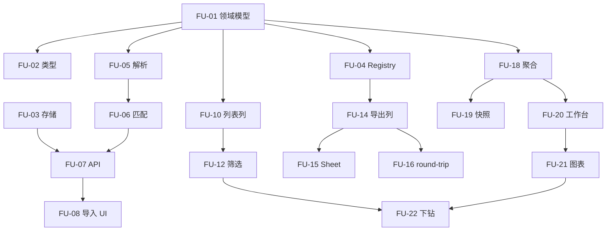

# 任务分解 · 用后即评 · 满意度回访

> **设计依据**：[DESIGN-用后即评-满意度回访.md](./DESIGN-用后即评-满意度回访.md)  
> **产品需求**：[data/用后即评.md](../data/用后即评.md) v0.5  
> 状态：可排期执行清单（**不含实现**）  
> 最后更新：2026-06-05

---

## 1. 如何使用

| 列 / 字段 | 含义 |
|-----------|------|
| **ID** | 唯一任务编号（`FU-xx`），便于 PR / Issue 引用 |
| **估时** | 单人日（d），含自测；不含 UAT 缓冲 |
| **依赖** | 必须先完成的任务 ID |
| **涉及文件** | 主要改动点，非穷尽 |
| **验收** | 完成判定标准 |

**建议迭代**：P0 → P1 → P2 → P3 → P4 → P5；P2 与 P1 后端可在接口就绪后并行 UI。

**不在本期**：官网/短信问卷；详情多次回访历史；88% 基线按产品配置（可二期）。

---

## 2. 里程碑总览

| 里程碑 | Phase | 目标 | 估时合计 | 出口标准 |
|--------|-------|------|----------|----------|
| M1 可导入 | P0 + P1 | 领域模型 + 回访报表导入补全工单 | ~10d | 上传回访 Excel 后工单带 `followUpSatisfaction` |
| M2 可见可筛 | P2 | 反馈库列表/详情/筛选 | ~4d | 列表列、详情区、三项筛选可用 |
| M3 可往返 | P3 | 分析结果导出/导入 v3 | ~4d | 来源+月份分 sheet；模板 round-trip |
| M4 可分析 | P4 + P5 | 工作台回访满意度 + 下钻 | ~8d | 10 分率趋势、非 10 分下钻、产品联动 |
| M5 质量收口 | P6 | 测试与文档 | ~2d | 单测/集成测绿；TEST-PLAN 条目 |

**全量估时**：约 **28 人日**（1 人约 6 周；2 人 P1/P2 并行约 3–4 周至 M3）。

---

## 3. Phase P0 · 领域模型与持久化（~3d）

> **目标**：`followUpSatisfaction` 类型、校验、展示格式化；存储可读写 patch。

### FU-01 · 领域模块 `followUpSatisfaction.js`（1d）✅

**状态**：已完成（2026-06-05）  
**依赖**：无  
**涉及**：`src/domain/followUpSatisfaction.js`、`src/domain/followUpSatisfaction.test.js`

| # | 子任务 |
|---|--------|
| 1 | 定义 `FollowUpSatisfaction`、`DissatisfiedReasonParts` 类型常量 |
| 2 | `normalizeFollowUpSatisfaction(input)`：score 1–10、problemResolved 枚举、followUpSuccessful |
| 3 | `formatFollowUpSatisfactionDisplay(fu)` → `10（已解决）` / `—` |
| 4 | `buildDissatisfiedReasonsSummary(parts)`：7+1 维拼接 |
| 5 | `parseFollowUpSatisfactionDisplay(text)`：供导入 round-trip 解析 `10（已解决）` |
| 6 | `resolveFollowUpTrendMonth(fu, ticketImportMonth)`：导入月 → fallback 工单 importMonth |
| 7 | 单测：normalize、display、parse、月份解析 |

**验收**：领域逻辑无 UI 依赖；单测覆盖边界（空、非法分、未解决/null）。

---

### FU-02 · 记录模型与类型对齐（0.5d）✅

**状态**：已完成（2026-06-05）  
**依赖**：FU-01  
**涉及**：`src/lib/types.js`、`src/domain/records.js`

| # | 子任务 |
|---|--------|
| 1 | `FeedbackRecord` / `TicketRecord` JSDoc 增加 `followUpSatisfaction?` |
| 2 | `hasFollowUpSatisfaction(record)`、`getFollowUpScore(record)` 等只读 helper（可选放 FU-01） |

**验收**：类型与领域模块一致；TS/JSDoc 无矛盾。

---

### FU-03 · 存储 patch 与 revision（0.5d）✅

**状态**：已完成（2026-06-05）  
**依赖**：FU-01  
**涉及**：`server/storageRepository.js`、`server/routes/storage.js`（record PATCH 路径）

| # | 子任务 |
|---|--------|
| 1 | 确认 JSON 存储 merge 保留 `followUpSatisfaction` 嵌套对象 |
| 2 | 回访 patch 时 `recordRevision + 1`、`updatedAt` / `updatedBy` |
| 3 | 单测或 API 测：仅更新回访字段不丢其它打标 |

**验收**：PATCH 工单仅写回访块；乐观锁行为与现有工单编辑一致。

---

### FU-04 · Field Registry 预留（1d）✅

**状态**：已完成（2026-06-05）  
**依赖**：FU-01  
**涉及**：`src/domain/fieldRegistry.js`、`src/domain/fieldRegistry.test.js`

| # | 子任务 |
|---|--------|
| 1 | 在 `urgency`（order 10）后插入 `followUpSatisfaction`、`followUpDissatisfiedReasons` |
| 2 | `applicableSources`: `complaint_ticket`, `consultation_ticket` |
| 3 | `detailZone`：满意度 B1（加急后）；不满意原因 A 区（用户请求上） |
| 4 | 后续字段 `exportOrder` / `importOrder` 顺延 + 单测更新 |

**验收**：`getExportColumns` / `getImportColumns` 顺序含新列且位于「是否加急」后。

---

## 4. Phase P1 · 回访报表导入（~7d）

> **目标**：独立导入流；匹配投诉/咨询工单；幂等；摘要与未匹配导出。

### FU-05 · 列预设与报表解析（1d）✅

**依赖**：FU-01  
**涉及**：`src/lib/columnPresets.js`、`src/lib/followUpSatisfactionImport.js`

| # | 子任务 |
|---|--------|
| 1 | 新增 `SATISFACTION_CALLBACK_PRESET`（§设计 4.2 列映射） |
| 2 | `detectPreset`：识别回访报表表头（回访工单编号 + 原工单编号） |
| 3 | `parseFollowUpSatisfactionRow(row)` → 结构化行 + parts + summary |
| 4 | `parseYesNo` / `parseProblemResolved` / `parseScore`（同义词） |

**验收**：样例 Excel/CSV 解析字段与 design §3.2 一致；单测含真实列名。

---

### FU-06 · 匹配与合并逻辑（1.5d）✅

**依赖**：FU-05  
**涉及**：`src/lib/followUpSatisfactionImport.js`

| # | 子任务 |
|---|--------|
| 1 | `buildTicketIndex(records)`：ticketId → record（投诉+咨询） |
| 2 | 仅 `followUpSuccessful` 行参与匹配；失败行计入 skipped |
| 3 | 未匹配 → `unmatched[]`；产品不一致 → `warnings[]` |
| 4 | 幂等：`followUpTicketId` 已存在于某工单 → 更新该工单 |
| 5 | 不同回访号覆盖同一原工单 → 最后一次导入 wins（批内顺序） |
| 6 | `importMonth` 写入；`outOfPeriodWarning`（原工单 insightPeriodId ≠ 导入周期） |

**验收**：单测覆盖：匹配、未匹配、跳过、幂等、周期外、产品警告。

---

### FU-07 · 导入 API（1.5d）✅

**依赖**：FU-03, FU-06  
**涉及**：`server/routes/storage.js` 或 `server/routes/followUpSatisfaction.js`、`server/schemas/`

| # | 子任务 |
|---|--------|
| 1 | `POST /api/storage/follow-up-satisfaction/import`（或等价路径） |
| 2 | 入参：`insightPeriodId`、`importMonth`、rows[] 或文件解析后 payload |
| 3 | 批量 patch；返回 `{ applied, unmatched, skipped, outOfPeriod, overwritten, warnings }` |
| 4 | `requirePermission('import')` + **import 全局锁** |
| 5 | 审计 `follow_up_satisfaction.import` |

**验收**：API 集成测；与工单导入/打标互斥；重复导入同回访号不 duplicate。

---

### FU-08 · 导入页 UI（2d）✅

**依赖**：FU-07  
**涉及**：`src/pages/Import.jsx` 或 `src/components/import/FollowUpSatisfactionImportPanel.jsx`

| # | 子任务 |
|---|--------|
| 1 | 入口：「导入满意度回访记录」（与工单导入区分） |
| 2 | 选择洞察周期 + **回访月份**（`InsightMonthPicker` 或同等） |
| 3 | 上传 → 预览表（成功/将匹配/将跳过）→ 确认 |
| 4 | 完成后展示摘要；**下载未匹配 CSV** |
| 5 | 导入中进度 / 全局锁占用提示 |

**验收**：手工 UAT：选月上传 → 反馈库对应工单出现回访字段。

---

### FU-09 · 导入链路单测与样例（1d）✅

**依赖**：FU-06, FU-07  
**涉及**：`src/lib/followUpSatisfactionImport.test.js`、`server/routes/*.test.js`

| # | 子任务 |
|---|--------|
| 1 | .fixture 小 Excel 或行数组 |
| 2 | 端到端：parse → match → patch 结构断言 |

**验收**：CI 绿；覆盖 design §8 导入相关要点。

---

## 5. Phase P2 · 反馈库展示与筛选（~4d）

> **目标**：列表列、详情区、筛选器。

### FU-10 · 列表「回访满意度」列（0.5d）✅

**依赖**：FU-01, FU-04  
**涉及**：`src/components/FeedbackTable.jsx`

| # | 子任务 |
|---|--------|
| 1 | 「数据来源」后插入列，render `formatFollowUpSatisfactionDisplay` |
| 2 | 无回访显示 `—` |

**验收**：有/无回访工单展示正确。

---

### FU-11 · 工单详情展示（1d）✅

**依赖**：FU-01, FU-04  
**涉及**：`src/components/FeedbackDrawer.jsx`、`src/lib/ticketDetailDisplay.js`

| # | 子任务 |
|---|--------|
| 1 | Zone B1：「是否加急」后只读「回访满意度」 |
| 2 | Zone A：「用户请求」上方只读「不满意原因」（汇总文本） |
| 3 | 无回访时不占位或显示「—」 |

**验收**：与 design §5.2 布局一致；只读不可编辑。

---

### FU-12 · 反馈库筛选（1.5d）✅

**依赖**：FU-10  
**涉及**：`src/pages/Feedbacks.jsx`、可选 `src/lib/feedbackFilters.js`

| # | 子任务 |
|---|--------|
| 1 | 筛选：有回访 / 无回访 |
| 2 | 筛选：10 分 / 非 10 分（仅有回访时语义清晰） |
| 3 | 筛选：已解决 / 未解决 |
| 4 | URL query 持久化（为 drill-down 预留，与 FU-20 对齐） |

**验收**：组合筛选结果正确；刷新/分享 URL 可复现。

---

### FU-13 · 列表/详情单测或 UAT 清单（1d）✅

**依赖**：FU-10, FU-11, FU-12  
**涉及**：组件测试或 `docs/TEST-PLAN.md` 条目

| # | 子任务 |
|---|--------|
| 1 | 显示 helper 单测 |
| 2 | TEST-PLAN 增加 FU 相关 P0/P1 行 |

**验收**：测试绿或 TEST-PLAN 已登记。

---

## 6. Phase P3 · 导出 / 导入分析结果 v3（~4d）

> **目标**：Field Registry 导出列；来源+月份 sheet；round-trip。

### FU-14 · 导出列与格式化（1d）✅

**依赖**：FU-04  
**涉及**：`src/lib/ticketAnalysisExport.js`、`src/lib/ticketAnalysisExport.test.js`

| # | 子任务 |
|---|--------|
| 1 | `EXPORT_ANALYSIS_VERSION` → 3 |
| 2 | `exportRegistryFieldValue` 处理回访两列 |
| 3 | `recordToExportRowV2` / 重命名兼容 |

**验收**：导出 Excel 在「是否加急」后含两列；值与详情一致。

---

### FU-15 · Sheet 按来源 + 月份分组（1d）✅

**依赖**：FU-14  
**涉及**：`src/lib/ticketAnalysisExport.js`

| # | 子任务 |
|---|--------|
| 1 | 替换/扩展 `groupRecordsByImportMonth` → `groupRecordsBySourceAndMonth` |
| 2 | Sheet 名：`投诉工单-2026年05月` / `咨询工单-未知月份`（长度截断） |
| 3 | 单测：分组键与 sheet 名 |

**验收**：混合来源+月份数据导出为多 sheet；命名符合 design §5.4。

---

### FU-16 · 导入分析 round-trip（1.5d）✅

**依赖**：FU-14, FU-01  
**涉及**：`src/lib/importAnalysis*.js`（或现有导入分析解析模块）、`overridePolicy` / patch 路径

| # | 子任务 |
|---|--------|
| 1 | 解析「回访满意度」「不满意原因」列（空 allowed） |
| 2 | `IMPORT_REPLACE` 或专用 scope：**仅 patch 回访字段** |
| 3 | 不触发 LLM 重打标 / 不 bump 全量 rebuild（与举措导入类似） |
| 4 | 更新导入模板生成（若独立 template 文件） |

**验收**：导出 → 改回访列 → 导入后工单回访字段更新；其它列不变。

---

### FU-17 · 导出/导入 v3 测试（0.5d）✅

**依赖**：FU-15, FU-16  
**涉及**：`ticketAnalysisExport.test.js`、import analysis test

**验收**：v3 表头顺序、sheet 分组、round-trip 单测绿。

---

## 7. Phase P4 · 分析聚合（~3d）

> **目标**：纯函数聚合，供工作台与快照共用。

### FU-18 · `followUpSatisfactionAnalytics.js`（1.5d）✅

**依赖**：FU-01  
**涉及**：`src/lib/followUpSatisfactionAnalytics.js`、`*.test.js`

| # | 子任务 |
|---|--------|
| 1 | 过滤：`followUpSuccessful && valid score` |
| 2 | `computeTenPointRateByMonth(productKey?)`：分子 10 分 / 分母回访成功 |
| 3 | `computeScoreDistributionByProduct`：1–9 计数，≤5 标记 |
| 4 | `computeNonTenScene/ProblemType/DissatisfiedReason` 分布（非 10 分 subset） |
| 5 | `computeUnresolvedStats` |
| 6 | 月份：`resolveFollowUpTrendMonth` |
| 7 | 不满意原因：按 `dissatisfiedReasonParts` 各维计数 |

**验收**：单测固定 fixture 断言率、分母、月份 bucket、原因维计数。

---

### FU-19 · 快照预聚合（1.5d）✅

**依赖**：FU-18  
**涉及**：`src/snapshots/buildSourceSnapshot.js`、`src/domain/snapshot.js`

| # | 子任务 |
|---|--------|
| 1 | 从周期内 **投诉+咨询工单**（非 post_use_rating 记录）收集有回访 subset |
| 2 | 快照 payload 增加 `followUpSatisfactionMetrics`（或等价 artifacts） |
| 3 | 重建洞察时刷新；PostUseRating Tab 读快照 fallback 实时算 |

**验收**：大库下 Tab 打开不全表 scan（优先读快照）；重建后指标一致。

---

## 8. Phase P5 · 工作台 UI（~5d）

> **目标**：用后即评 Tab · 回访满意度模块；产品联动；下钻。

### FU-20 · `FollowUpSatisfactionPanel` 布局（2d）✅

**依赖**：FU-18, FU-19  
**涉及**：`src/components/workbench/FollowUpSatisfactionPanel.jsx`、`PostUseRatingDashboardView.jsx`

| # | 子任务 |
|---|--------|
| 1 | 模块标题「回访满意度」 |
| 2 | **10 分满意率月度趋势**：多产品折线 + **88% 参考线** |
| 3 | **非 10 分 · 得分分布**：分产品，≤5 标红 |
| 4 | 空数据 / 无回访友好提示 |
| 5 | 接入 `PostUseRatingDashboardView`（替换或并列 Stub 区块） |

**验收**：选周期有数据时图表渲染；88% 基线可见。

---

### FU-21 · 非 10 分下钻图表（1.5d）✅

**依赖**：FU-20  
**涉及**：`FollowUpSatisfactionPanel.jsx`、`ThemeBarChart` 或同类

| # | 子任务 |
|---|--------|
| 1 | 请求场景 / 问题类型 / 不满意原因 条形图 |
| 2 | 未解决数量及占比 Statistic |
| 3 | **产品 Select**：联动后 4 项过滤 |

**验收**：切换产品后四图数据变化；仅统计非 10 分工单。

---

### FU-22 · Drill-down 至反馈库（1d）✅

**依赖**：FU-12, FU-21  
**涉及**：`src/lib/workbenchAnalysisLink.js`（或新建）、`Feedbacks.jsx`

| # | 子任务 |
|---|--------|
| 1 | 定义 query：`followUp=non10`、`productKey`、`requestScene`、`problemType`、`reasonDim` 等 |
| 2 | 图表点击 / 「查看工单」跳转 `/feedbacks?...` |
| 3 | Feedbacks 解析 query 应用 FU-12 筛选 |

**验收**：从条形图点选 → 反馈库列表与图表 subset 一致。

---

### FU-23 · PDF / 报告截图钩子（0.5d，可选）✅

**依赖**：FU-20  
**涉及**：`src/lib/report/captureChartImages.js`

| # | 子任务 |
|---|--------|
| 1 | 为新图表加 `data-pdf-chart` 标识（若报告需纳入） |

**验收**：与现有报告流程不报错；可二期再做。

---

## 9. Phase P6 · 质量收口（~2d）

### FU-24 · 集成测试与 TEST-PLAN（1d）✅

**依赖**：FU-09, FU-17, FU-18  
**涉及**：`docs/TEST-PLAN.md`

| # | 子任务 |
|---|--------|
| 1 | 登记 P0：导入补全、10 分率分母、幂等、sheet 分组 |
| 2 | 登记 P1：筛选、下钻 URL、round-trip |
| 3 | 补 CI 缺口用例 |

**验收**：`npm test` 绿；TEST-PLAN 可追踪。

---

### FU-25 · 文档与 DESIGN 链接（0.5d）✅

**依赖**：M1–M4 完成  
**涉及**：`DESIGN-用后即评-满意度回访.md`、`DESIGN-20260601-1.md`（可选 § 引用）

| # | 子任务 |
|---|--------|
| 1 | 设计文档 §7 实现索引更新为实际路径 |
| 2 | 变更记录：实现完成日期 |

**验收**：文档与代码一致。

---

### FU-26 · 手工 UAT 清单（0.5d）✅

**依赖**：FU-08, FU-22  
**涉及**：`docs/TEST-PLAN.md` 或 `docs/FEEDBACK-*-UAT.md`

| # | 子任务 |
|---|--------|
| 1 | 导入 → 列表 → 详情 → 导出 → 改列 → 导入 |
| 2 | 工作台趋势 + 产品联动 + 下钻 |
| 3 | 周期外工单 `outOfPeriodWarning` 可见（若 UI 已有展示位） |

**验收**：UAT checklist 可执行通过。

---

## 10. 依赖关系简图

---

## 11. 排期建议（2 人示例）

| 周 | 开发者 A | 开发者 B |
|----|----------|----------|
| W1 | FU-01～04, FU-05～06 | — |
| W2 | FU-07, FU-09 | FU-08（API 就绪后） |
| W3 | FU-14～17 | FU-10～13 |
| W4 | FU-18～19 | FU-20～21 |
| W5 | FU-22, FU-24～26 | 联调 + UAT |

---

## 12. 变更记录

| 日期 | 说明 |
|------|------|
| 2026-06-05 | 初稿：按 DESIGN 分解 P0–P6，26 项任务，约 28 人日 |
| 2026-06-05 | **P0 完成**（FU-01～04） |
| 2026-06-05 | **P1 完成**（FU-05～09）：列预设、匹配逻辑、导入 API、ImportHub Tab UI、集成测 |
| 2026-06-05 | **P2 完成**（FU-10～13）：列表列、详情展示、反馈库筛选与 URL、单测与 TEST-PLAN |
| 2026-06-05 | **P3 完成**（FU-14～17）：导出 v3、来源+月份 sheet、分析结果 round-trip |
| 2026-06-05 | **P4 完成**（FU-18～19）：`followUpSatisfactionAnalytics.js`、快照 `followUpSatisfactionMetrics` |
| 2026-06-05 | **P5 完成**（FU-20～23）：`FollowUpSatisfactionPanel`、图表下钻、PDF 钩子 |
| 2026-06-05 | **P6 完成**（FU-24～26）：TEST-PLAN TAG-FU、集成测、`FOLLOW-UP-SATISFACTION-UAT.md` |
